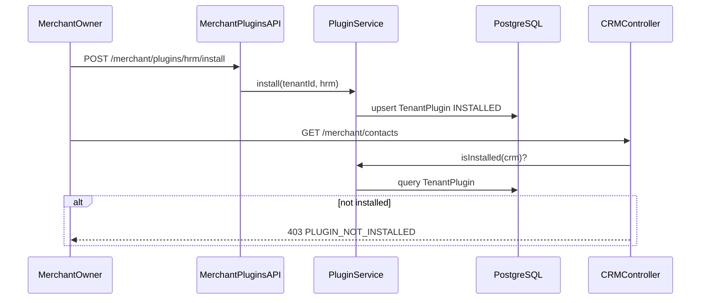

# Merchant Plugin System — Architecture

**Version:** 1.0.0  
**Updated:** 2026-07-04

## Overview

Optional merchant modules (CRM, HRM, IM, finance/tax, OA, e-signature, customer service) are modeled as platform catalog plugins with per-tenant installation records. Ecommerce core modules remain always available without plugin gating.

## Data flow



## Data model

```prisma
enum PluginCatalogStatus { ACTIVE COMING_SOON DEPRECATED }
enum TenantPluginStatus { INSTALLED UNINSTALLED }

model PluginDefinition {
  id, code @unique, category, icon, sortOrder
  nameKey, descriptionKey
  navRoutes Json?
  status PluginCatalogStatus @default(ACTIVE)
  isDefaultOnSignup Boolean @default(false)
  installations TenantPlugin[]
}

model TenantPlugin {
  id, tenantId, pluginId
  status TenantPluginStatus @default(INSTALLED)
  installedAt, uninstalledAt?, installedByUserId?
  @@unique([tenantId, pluginId])
}
```

## API contracts

| Method | Path | Auth | Response |
|--------|------|------|----------|
| GET | `/merchant/plugins` | Merchant JWT | `MerchantPluginCatalogResponse` |
| GET | `/merchant/plugins/installed-codes` | Merchant JWT | `MerchantInstalledPluginsResponse` |
| POST | `/merchant/plugins/:code/install` | Merchant Owner | `MerchantPluginCatalogItem` |
| DELETE | `/merchant/plugins/:code/uninstall` | Merchant Owner | `{ code, status }` |
| GET | `/platform/merchants/:id/plugins` | SUPER_ADMIN, REVIEWER | `PlatformMerchantPluginsResponse` |

403 when plugin not installed: `{ statusCode: 403, message: '...', code: 'PLUGIN_NOT_INSTALLED' }`

## Module boundaries

| Module | Path | Responsibility |
|--------|------|----------------|
| PluginModule | `apps/api/src/plugins/` | PluginService, PluginGuard, `@RequiresPlugin`, catalog seed |
| MerchantPluginsModule | `apps/api/src/merchant/plugins/` | Marketplace install/uninstall |
| PlatformMerchants | `apps/api/src/platform/merchants/` | Admin read-only plugin list |

CRM controllers in `apps/api/src/merchant/crm/**` add `@RequiresPlugin('crm')`.

## ADR: Catalog table + guard vs env flags

**Decision:** Store plugin catalog in `PluginDefinition` and tenant state in `TenantPlugin`; enforce with NestJS guard.

**Rationale:** Supports per-tenant install history, admin visibility, future billing, and nav/API consistency. Env flags cannot represent per-merchant state.

## Migration and seed

1. Prisma migration adds models and enums.
2. `seed.ts` upserts 7 plugin definitions; `crm.isDefaultOnSignup = true`.
3. Seed loop: for each `Tenant`, ensure `crm` installation exists.
4. `PluginService.installDefaultPlugins(tenantId)` called on merchant approve and admin auto-approve create.

## Non-goals

Billing, admin force install, plugin versioning, dependency resolution.
