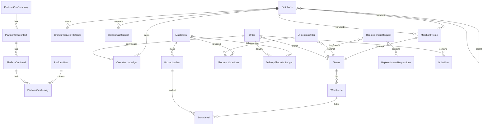

# Phase 5 — Distribution Network & Factory Allocation Architecture

**Version:** 1.0  
**Last updated:** 2025-06-25  
**Status:** Implemented; retained as Phase 5 architecture reference  
**PRD:** `docs/prd/phase-5-distribution-and-allocation.md`  
**Depends on:** Phase 1 (distributors, bindings), Phase 2 (orders, commission ledger), Phase 3 (warehouses, `StockLevel`), Phase 4 (distributor portal, store bind)

## Overview

Phase 5 introduces the **HQ ↔ Branch channel model**: the platform (factory/HQ) owns master inventory and ships **delivery** orders; merchant branches operate storefronts, hold branch warehouse stock for **pickup**, and run a distributor tree for channel sales. Commission and inventory side-effects move from **`PAID`** to **`FULFILLED`**, with recruitment attribution on `MerchantProfile.recruitedByDistributorId`.

### Locked decisions

| Topic | Decision |
|-------|----------|
| Distributor scope | `Distributor.tenantId` **nullable** — `null` = HQ/platform agent; non-null = branch-scoped agent |
| Merchant recruitment | `MerchantProfile.recruitedByDistributorId` → HQ distributor who recruited the branch |
| Branch invite codes | New `BranchRecruitInviteCode` table (not `DistributorQrCode`) — 6-char `A–Z`, multi-use until revoked |
| Platform CRM | Isolated `PlatformCrm*` tables — no `@BypassTenant()` on merchant CRM |
| Master catalog | `MasterSku` platform-wide; optional `ProductVariant.masterSkuId` link for delivery decrement |
| Allocation confirm | Increments branch `StockLevel` at default warehouse; auto-creates/links tenant `Product` when `masterSkuId` missing |
| Commission P0 | **Direct recruiter only** — credit `recruitedByDistributorId` on `FULFILLED`; no N-level split |
| Commission trigger | `order.accrue` on **`FULFILLED`** (pickup verify or HQ ship), **not** `PAID` |
| Inventory on `PAID` | **No decrement** (breaking change vs Phase 2/3) |
| Pickup inventory | `POST merchant/orders/:id/verify-pickup` → decrement branch default warehouse `StockLevel` |
| Delivery inventory | `POST platform/orders/:id/ship` → decrement `MasterSku.quantityOnHand`; write `DeliveryAllocationLedger` |
| Withdrawal balance | **Reserve on PENDING** — `available = accruedUnsettled - pendingReservations` |
| Withdrawal concurrency | **One PENDING per distributor** — reject second submit with `409` |
| Published stores | `MerchantProfile.onboardingStatus = APPROVED` **and** `storePublished = true` (new flag, default `false`; backfill `true` for existing approved) |
| Customer promotion (P1) | Reuse `Distributor` with `kind = CUSTOMER_PROMOTER`; gated by `TenantSettings.allowCustomerPromotion` |
| Downline rate edit P0 | **Merchant portal only** — distributor portal read-only for rates |
| Currency | CNY, 2 decimal places (`Decimal(12,2)` money, `Decimal(10,4)` rates) |
| QR bind | Unchanged (Phase 4); coexists with invite codes; one binding per entity |

Shared contracts: new modules under `packages/shared/src/` (see [Shared DTOs](#shared-dtos-packagesshared)).

---

## Domain model — HQ ↔ Branch

```
Platform (HQ)
├── MasterSku catalog + factory on-hand
├── PlatformCrm* (B2B pipeline)
├── AllocationOrder → merchant branch warehouses
├── Ships DELIVERY orders (MasterSku decrement)
└── Distributor (tenantId = null) — recruits merchant branches
         │
         ▼ recruitedByDistributorId
Merchant branch (Tenant)
├── MerchantProfile + default Warehouse (pickup stock)
├── BranchRecruitInviteCode → branch Distributor tree (tenantId set)
├── ReplenishmentRequest → factory
├── Verifies PICKUP orders (branch StockLevel decrement)
└── Approves branch-scoped WithdrawalRequest
```

**Order fulfillment split**

| `fulfillmentType` | Fulfilled by | Inventory source | Commission trigger |
|-----------------|--------------|------------------|--------------------|
| `PICKUP` | Merchant (`verify-pickup`) | Branch default `Warehouse` / `StockLevel` | On `FULFILLED` |
| `DELIVERY` | Platform (`ship`) | `MasterSku.quantityOnHand` | On `FULFILLED` |

---

## Entity relationship

### ER diagram (core Phase 5)



### `Distributor` (extended)

| Field | Type | Notes |
|-------|------|-------|
| `id` | `cuid` | PK |
| `tenantId` | `String?` | **`null`** = HQ/platform distributor; **set** = branch-scoped |
| `parentDistributorId` | `String?` | Self-FK; upline in branch tree; HQ distributors typically `null` parent |
| `kind` | `DistributorKind` | `AGENT` (default), `CUSTOMER_PROMOTER` (P1) |
| `name`, `email`, `phone` | | Portal identity |
| `passwordHash`, `portalEnabled`, `lastLoginAt` | | Phase 4 portal |
| `commissionRate`, `commissionType`, `isActive` | | Default rate |
| `customerId` | `String?` | When promoted from store customer (branch scope) |

**Constraints**

- `@@index([tenantId])`, `@@index([parentDistributorId])`
- Partial unique: `(tenantId, email)` where email not null and tenantId not null
- HQ distributor: `tenantId IS NULL` — recruits merchants only (no branch cart attribution in P0)
- Branch distributor: `tenantId IS NOT NULL` — downline tree + optional customer bind (Phase 4)

### `DistributorCommissionOverride` (new)

| Field | Type | Notes |
|-------|------|-------|
| `id` | `cuid` | PK |
| `tenantId` | `String` | Branch scope |
| `parentDistributorId` | `String` | Upline setting rate |
| `childDistributorId` | `String` | Direct downline |
| `commissionRate` | `Decimal(10,4)` | |
| `commissionType` | `CommissionType` | |
| `effectiveFrom` | `DateTime` | |
| `createdByUserId` | `String?` | Merchant actor |
| `revokedAt` | `DateTime?` | |

`@@unique([parentDistributorId, childDistributorId])` where `revokedAt IS NULL` (enforce in service).

### `MerchantProfile` (extended)

| Field | Type | Notes |
|-------|------|-------|
| `recruitedByDistributorId` | `String?` | FK → `Distributor` where `tenantId IS NULL` |
| `recruitedAt` | `DateTime?` | Set on approval / recruit bind |
| `storePublished` | `Boolean` | Default `false`; gates store picker (US-5.1) |

Commission lookup: `order.tenantId` → `MerchantProfile.recruitedByDistributorId`.

### `BranchRecruitInviteCode` (new)

| Field | Type | Notes |
|-------|------|-------|
| `id` | `cuid` | PK |
| `code` | `String(6)` | `^[A-Z]{6}$` |
| `tenantId` | `String` | Branch scope |
| `inviterDistributorId` | `String` | Must be active branch distributor |
| `targetKind` | `InviteTargetKind` | `DISTRIBUTOR` (P0); `CUSTOMER_PROMOTER` (P1) |
| `revokedAt` | `DateTime?` | |
| `expiresAt` | `DateTime?` | Optional; default null = no expiry |
| `useCount` | `Int` | Audit counter |
| `createdAt` | `DateTime` | |

`@@unique([tenantId, code])` — uniqueness per branch.  
Validation: rate-limit `POST` validate endpoint (10 req/min/IP + 5/min/code).

**Share URL:** `{STORE_APP_URL}/s/{tenantSlug}/register?invite={CODE}`

### `MasterSku` (new, platform-scoped)

| Field | Type | Notes |
|-------|------|-------|
| `id` | `cuid` | PK |
| `skuCode` | `String` | Unique platform-wide |
| `name` | `String` | |
| `quantityOnHand` | `Int` | Factory stock (delivery source) |
| `cumulativeShippedQty` | `Int` | Increments on each delivery ship |
| `unitCost` | `Decimal(12,2)` | 成本 |
| `wholesalePrice` | `Decimal(12,2)` | 下级拿货价 |
| `retailPrice` | `Decimal(12,2)` | 最终售价 |
| `isActive` | `Boolean` | |
| `createdAt`, `updatedAt` | | |

### `AllocationOrder` + `AllocationOrderLine` (new)

**`AllocationOrder`**

| Field | Type | Notes |
|-------|------|-------|
| `id` | `cuid` | |
| `tenantId` | `String` | Destination branch |
| `status` | `AllocationOrderStatus` | `DRAFT` → `ISSUED` → `CONFIRMED` \| `CANCELLED` |
| `issuedAt`, `confirmedAt` | `DateTime?` | |
| `issuedByPlatformUserId` | `String?` | |
| `confirmedByUserId` | `String?` | Merchant user |
| `note` | `String?` | |

**`AllocationOrderLine`**

| Field | Type |
|-------|------|
| `allocationOrderId` | FK |
| `masterSkuId` | FK |
| `quantity` | `Int` |
| `quantityConfirmed` | `Int` default 0 |

**Issue rules:** `ISSUED` validates `quantityOnHand` is **not** decremented at issue — factory reserves logically via draft; on `CONFIRMED`, increment branch `StockLevel` (via linked variant) and optionally decrement `MasterSku` if architect chooses factory deduction on confirm (see ADR-5).

**P0 choice:** Decrement `MasterSku.quantityOnHand` on **`ISSUED`** (reserve factory stock); increment branch stock on **`CONFIRMED`**. Cancel `ISSUED` → restore master on-hand.

### `ReplenishmentRequest` + `ReplenishmentRequestLine` (new)

| Field | Type | Notes |
|-------|------|-------|
| `tenantId` | `String` | Requesting branch |
| `status` | `ReplenishmentRequestStatus` | `PENDING` → `APPROVED` \| `REJECTED` |
| `rejectionReason` | `String?` | |
| `allocationOrderId` | `String?` | Set when admin spawns allocation |
| Lines | `masterSkuId`, `quantity` | |

### `WithdrawalRequest` (new)

| Field | Type | Notes |
|-------|------|-------|
| `id` | `cuid` | |
| `distributorId` | `String` | |
| `tenantId` | `String?` | Denormalized from distributor; null for HQ distributor |
| `amount` | `Decimal(12,2)` | CNY |
| `status` | `WithdrawalRequestStatus` | `PENDING` → `APPROVED` \| `REJECTED` |
| `note` | `String?` | Distributor note |
| `rejectionReason` | `String?` | |
| `reviewedByUserId` | `String?` | Merchant or platform user |
| `reviewedAt` | `DateTime?` | |
| `reservedLedgerEntryIds` | `Json?` | Optional trace of reserved ACCRUED rows |

**Approver routing**

| Distributor scope | Approver endpoint |
|-------------------|-------------------|
| `tenantId` set (branch) | `merchant/...` withdrawal review |
| `tenantId` null (HQ) | `platform/withdrawals` |

On `APPROVED`: mark reserved commission as `SETTLED` (or create offset ledger — P0: transition ACCRUED → SETTLED up to amount). On `REJECTED`: release reservation.

### `PlatformCrm*` (new, isolated)

Mirror merchant CRM shape without `tenantId`:

- `PlatformCrmCompany` — `id`, `name`, `website`, timestamps
- `PlatformCrmContact` — `id`, `companyId?`, `firstName`, `lastName`, `email?`, `phone?`
- `PlatformCrmLead` — `id`, `contactId?`, `title`, `stage` (`LeadStage`), `source?`, `assignedPlatformUserId?`
- `PlatformCrmActivity` — `id`, `contactId?`, `leadId?`, `type`, `note`, `createdAt`

No FK to `Tenant`. Platform admin module only.

### `Order` (extended)

| Field | Type | Notes |
|-------|------|-------|
| `fulfillmentType` | `FulfillmentType` | `PICKUP` \| `DELIVERY` — set at checkout |
| `fulfillmentStatus` | `FulfillmentStatus` | `AWAITING` → `READY`? → `FULFILLED` (see below) |
| `pickupVerifiedAt` | `DateTime?` | Merchant verify |
| `pickupVerifiedByUserId` | `String?` | |
| `shippedAt` | `DateTime?` | Platform ship |
| `shippedByPlatformUserId` | `String?` | |
| `trackingNumber` | `String?` | Delivery only |
| `fulfilledAt` | `DateTime?` | When status → `FULFILLED` |

**Status flow**

```
PENDING_PAYMENT → PAID → (fulfillment) → FULFILLED
```

- `PAID`: payment confirmed; **no inventory decrement**
- `PICKUP`: merchant calls `verify-pickup` → `FULFILLED` + branch stock decrement + commission
- `DELIVERY`: platform calls `ship` → `FULFILLED` + master SKU decrement + `DeliveryAllocationLedger` + commission

`Order.status` remains `OrderStatus`; `fulfillmentStatus` tracks fulfillment sub-state while `PAID`.

### `DeliveryAllocationLedger` (new)

| Field | Type | Notes |
|-------|------|-------|
| `id` | `cuid` | |
| `orderId` | FK | |
| `orderLineId` | FK | |
| `masterSkuId` | FK | |
| `quantity` | `Int` | Shipped qty |
| `masterSkuOnHandBefore` | `Int` | Audit |
| `masterSkuOnHandAfter` | `Int` | Audit |
| `createdAt` | `DateTime` | |

`@@unique([orderLineId])` — one ledger row per line at ship time.

### `ProductVariant` (extended)

| Field | Type | Notes |
|-------|------|-------|
| `masterSkuId` | `String?` | FK → `MasterSku`; required for `DELIVERY` lines at checkout |

---

## Prisma schema sketch

```prisma
enum DistributorKind {
  AGENT
  CUSTOMER_PROMOTER
}

enum InviteTargetKind {
  DISTRIBUTOR
  CUSTOMER_PROMOTER
}

enum FulfillmentType {
  PICKUP
  DELIVERY
}

enum FulfillmentStatus {
  AWAITING
  FULFILLED
}

enum AllocationOrderStatus {
  DRAFT
  ISSUED
  CONFIRMED
  CANCELLED
}

enum ReplenishmentRequestStatus {
  PENDING
  APPROVED
  REJECTED
}

enum WithdrawalRequestStatus {
  PENDING
  APPROVED
  REJECTED
}

model Distributor {
  id                   String    @id @default(cuid())
  tenantId             String?
  tenant               Tenant?   @relation(fields: [tenantId], references: [id])
  parentDistributorId  String?
  parent               Distributor?  @relation("DistributorTree", fields: [parentDistributorId], references: [id])
  children             Distributor[] @relation("DistributorTree")
  kind                 DistributorKind @default(AGENT)
  customerId           String?
  // ... existing fields ...
  recruitInviteCodes   BranchRecruitInviteCode[]
  recruitedMerchants   MerchantProfile[] @relation("RecruitedBy")
  commissionOverridesParent DistributorCommissionOverride[] @relation("OverrideParent")
  commissionOverridesChild  DistributorCommissionOverride[] @relation("OverrideChild")
  withdrawalRequests   WithdrawalRequest[]

  @@index([tenantId])
  @@index([parentDistributorId])
}

model MerchantProfile {
  // ... existing ...
  recruitedByDistributorId String?
  recruitedBy              Distributor? @relation("RecruitedBy", fields: [recruitedByDistributorId], references: [id])
  recruitedAt              DateTime?
  storePublished           Boolean      @default(false)
}

model BranchRecruitInviteCode {
  id                   String           @id @default(cuid())
  tenantId             String
  tenant               Tenant           @relation(fields: [tenantId], references: [id])
  inviterDistributorId String
  inviter              Distributor      @relation(fields: [inviterDistributorId], references: [id])
  code                 String
  targetKind           InviteTargetKind @default(DISTRIBUTOR)
  revokedAt            DateTime?
  expiresAt            DateTime?
  useCount             Int              @default(0)
  createdAt            DateTime         @default(now())

  @@unique([tenantId, code])
  @@index([inviterDistributorId])
}

model MasterSku { /* see above */ }

model AllocationOrder { /* see above */ }
model AllocationOrderLine { /* see above */ }

model ReplenishmentRequest { /* see above */ }
model ReplenishmentRequestLine { /* see above */ }

model WithdrawalRequest { /* see above */ }

model PlatformCrmCompany { /* see above */ }
model PlatformCrmContact { /* see above */ }
model PlatformCrmLead { /* see above */ }
model PlatformCrmActivity { /* see above */ }

model DeliveryAllocationLedger { /* see above */ }
```

---

## API contracts

Base path: `/api/v1`. Errors: `{ statusCode, message, error, details? }`.

### `platform/distributors`

| Method | Path | Auth | Description |
|--------|------|------|-------------|
| GET | `/platform/distributors` | Platform | List HQ distributors (`tenantId` null) + filters |
| POST | `/platform/distributors` | Platform | Create HQ distributor |
| GET | `/platform/distributors/:id` | Platform | Detail incl. `recruitedMerchants` count |
| PATCH | `/platform/distributors/:id` | Platform | Update rate, active, portal |
| GET | `/platform/distributors/:id/merchants` | Platform | Merchants with `recruitedByDistributorId = :id` |
| POST | `/platform/distributors/:id/merchant-invite` | Platform | Generate merchant-recruit code (stored as platform-scoped invite — see note) |

**Note:** Merchant recruitment at platform level uses `PlatformMerchantInviteCode` **or** `BranchRecruitInviteCode` with a dedicated `tenantId` placeholder — **P0:** store on `PlatformMerchantInviteCode` (`code`, `inviterDistributorId`, same 6-char format) to avoid null `tenantId` on branch codes. Architect consolidates to one invite service with `scope: PLATFORM_MERCHANT | BRANCH_DISTRIBUTOR`.

| Response field (list item) | Type |
|----------------------------|------|
| `id`, `name`, `email`, `isActive`, `commissionRate`, `commissionType` | |
| `recruitedMerchantCount` | `number` |
| `portalEnabled` | `boolean` |

### `platform/allocations`

| Method | Path | Auth | Description |
|--------|------|------|-------------|
| GET | `/platform/allocations` | Platform | Paginated list (`status`, `tenantId`) |
| POST | `/platform/allocations` | Platform | Create `DRAFT` with lines |
| GET | `/platform/allocations/:id` | Platform | Detail + lines |
| PATCH | `/platform/allocations/:id` | Platform | Edit draft lines |
| POST | `/platform/allocations/:id/issue` | Platform | `DRAFT` → `ISSUED`; reserve `MasterSku` |
| POST | `/platform/allocations/:id/cancel` | Platform | Cancel draft/issued |

### `platform/withdrawals`

| Method | Path | Auth | Description |
|--------|------|------|-------------|
| GET | `/platform/withdrawals` | Platform | HQ distributor requests (`tenantId` null) |
| GET | `/platform/withdrawals/:id` | Platform | Detail |
| POST | `/platform/withdrawals/:id/approve` | Platform | `PENDING` → `APPROVED` |
| POST | `/platform/withdrawals/:id/reject` | Platform | Body: `{ rejectionReason }` |

### `platform/funds`

| Method | Path | Auth | Description |
|--------|------|------|-------------|
| GET | `/platform/funds/summary` | Platform | HQ financial snapshot |
| GET | `/platform/funds/master-skus` | Platform | Master SKU inventory valuation |

**`PlatformFundsSummary`:** `masterInventoryValue`, `masterSkuCount`, `pendingAllocationCount`, `pendingReplenishmentCount`, `hqCommissionAccrued`, `hqWithdrawalPending`.

### `platform/orders` — ship

| Method | Path | Auth | Description |
|--------|------|------|-------------|
| GET | `/platform/orders` | Platform | Cross-tenant; filter `fulfillmentType=DELIVERY`, `status=PAID` |
| GET | `/platform/orders/:id` | Platform | Detail + lines + `masterSku` mapping |
| POST | `/platform/orders/:id/ship` | Platform | Ship delivery order → `FULFILLED` |

**`ShipOrderRequest`:** `{ trackingNumber?: string, lines?: { orderLineId, quantity }[] }` — default all lines full qty.

**`ShipOrderResponse`:** `{ order, deliveryLedgerEntries[], masterSkuAdjustments[] }`

**Idempotency:** Reject if `order.status === FULFILLED`.

### `merchant/funds`

| Method | Path | Auth | Description |
|--------|------|------|-------------|
| GET | `/merchant/funds/summary` | Merchant | Branch fund snapshot |
| GET | `/merchant/funds/allocations` | Merchant | Received allocation history |

**`MerchantFundsSummary`:** `branchInventoryValue`, `pendingReplenishmentCount`, `distributorWithdrawalPending`, `pickupOrdersAwaitingVerify`.

### `merchant/replenishment`

| Method | Path | Auth | Description |
|--------|------|------|-------------|
| GET | `/merchant/replenishment` | Merchant | List requests |
| POST | `/merchant/replenishment` | Merchant | Create `PENDING` |
| GET | `/merchant/replenishment/:id` | Merchant | Detail |
| GET | `/merchant/allocations` | Merchant | Inbound allocation orders |
| POST | `/merchant/allocations/:id/confirm` | Merchant | `ISSUED` → `CONFIRMED` |

### `merchant/orders` — verify-pickup

| Method | Path | Auth | Description |
|--------|------|------|-------------|
| GET | `/merchant/orders` | Merchant | Extend filter: `fulfillmentType`, `fulfillmentStatus` |
| POST | `/merchant/orders/:id/verify-pickup` | Merchant | Pickup fulfill |

**`VerifyPickupRequest`:** `{ pickupCode?: string }` — optional OTP future; P0 merchant auth sufficient.

**Preconditions:** `status === PAID`, `fulfillmentType === PICKUP`, not yet `FULFILLED`.

**Effects (transaction):**

1. Decrement `StockLevel` at default warehouse per line (`InventoryService`)
2. `order.status = FULFILLED`, `fulfillmentStatus = FULFILLED`, `pickupVerifiedAt = now()`
3. `CommissionService.accrueOnFulfilled(orderId)`

### `distributor/me/branches`

| Method | Path | Auth | Description |
|--------|------|------|-------------|
| GET | `/distributor/me/branches` | Distributor JWT | HQ distributor: recruited merchants |
| GET | `/distributor/me/downline` | Distributor JWT | Branch distributor: child distributors |
| GET | `/distributor/me/uplines` | Distributor JWT | Parent chain + effective rate (US-5.10) |
| GET | `/distributor/me/invite-codes` | Distributor JWT | Branch: list active codes |
| POST | `/distributor/me/invite-codes` | Distributor JWT | Branch: generate code (if RBAC allows) |

**`DistributorBranchRow`:** `{ tenantId, slug, businessName, recruitedAt, storePublished, orderCount30d, revenue30d }`

### `distributor/me/withdrawals`

| Method | Path | Auth | Description |
|--------|------|------|-------------|
| GET | `/distributor/me/withdrawals` | Distributor JWT | List own requests |
| GET | `/distributor/me/balance` | Distributor JWT | Available / accrued / pending |
| POST | `/distributor/me/withdrawals` | Distributor JWT | Submit request |

**`CreateWithdrawalRequest`:** `{ amount: string, note?: string }`

### `merchant/distributors` (branch management — extends Phase 1)

| Method | Path | Auth | Description |
|--------|------|------|-------------|
| GET | `/merchant/distributors` | Merchant | Tree list with `parent`, `downlineCount` |
| POST | `/merchant/distributors/:id/promote-customer` | Merchant | Promote customer → distributor |
| POST | `/merchant/distributors/:id/invite-codes` | Merchant | Generate `BranchRecruitInviteCode` |
| DELETE | `/merchant/distributors/invite-codes/:codeId` | Merchant | Revoke |
| PUT | `/merchant/distributors/:parentId/downline/:childId/commission` | Merchant | Upsert override |
| DELETE | `/merchant/distributors/:parentId/downline/:childId/commission` | Merchant | Revoke override |
| GET | `/merchant/withdrawals` | Merchant | Branch distributor withdrawals |
| POST | `/merchant/withdrawals/:id/approve` | Merchant | Approve |
| POST | `/merchant/withdrawals/:id/reject` | Merchant | Reject |

### `store` — checkout `fulfillmentType`

| Method | Path | Auth | Description |
|--------|------|------|-------------|
| GET | `/store/stores` | Public | Published store list (existing `PublishedStoreListResponse`) |
| POST | `/store/:slug/checkout` | Guest/Customer | **Extended body** |
| POST | `/store/:slug/auth/register` | Public | **Extended body** — `invite` code |
| POST | `/store/:slug/invite/validate` | Public | Pre-validate invite (rate-limited) |

**`CheckoutRequest` (extended):**

```typescript
{
  guestEmail?: string;
  fulfillmentType: 'PICKUP' | 'DELIVERY';
}
```

**Checkout validation**

| Rule | PICKUP | DELIVERY |
|------|--------|----------|
| Stock check | Branch default warehouse `StockLevel` | `MasterSku.quantityOnHand` via `variant.masterSkuId` |
| Line mapping | `ProductVariant` only | Requires `masterSkuId` on all variants |
| Decrement timing | On verify-pickup | On platform ship |

**`RegisterRequest` (extended):** `{ email, password, firstName?, lastName?, invite?: string }` — validates `BranchRecruitInviteCode`, creates branch `Distributor` with `parentDistributorId = inviter`.

### `platform/master-skus` + `platform/replenishment` + `platform/crm`

| Method | Path | Auth | Description |
|--------|------|------|-------------|
| CRUD | `/platform/master-skus` | Platform | Master catalog |
| CRUD | `/platform/crm/companies` | Platform | Platform CRM |
| CRUD | `/platform/crm/contacts` | Platform | |
| CRUD | `/platform/crm/leads` | Platform | |
| CRUD | `/platform/crm/activities` | Platform | |
| GET | `/platform/replenishment` | Platform | Merchant replenishment inbox |
| POST | `/platform/replenishment/:id/approve` | Platform | Spawn allocation optional |
| POST | `/platform/replenishment/:id/reject` | Platform | |

---

## Commission accrual

### Trigger: `FULFILLED` only

Replace `CommissionService.accrueOnPaid` call in Stripe webhook with **`accrueOnFulfilled`**, invoked from:

1. `merchant/orders/:id/verify-pickup`
2. `platform/orders/:id/ship`

Remove inventory decrement from `PAID` webhook handler.

### Attribution

```typescript
async accrueOnFulfilled(orderId: string): Promise<void> {
  const order = await prisma.order.findUnique({ where: { id: orderId }, include: { commissionEntry: true } });
  if (!order || order.status !== OrderStatus.FULFILLED || order.commissionEntry) return;

  const profile = await prisma.merchantProfile.findUnique({ where: { tenantId: order.tenantId } });
  const distributorId = profile?.recruitedByDistributorId;
  if (!distributorId) return;

  const distributor = await prisma.distributor.findFirst({
    where: { id: distributorId, isActive: true },
  });
  if (!distributor) return;

  const rate = await resolveEffectiveRate(distributor, order.tenantId); // override N/A for HQ recruit — use distributor default
  const amount = calculateAmount(order.total, rate);
  // create CommissionLedger ACCRUED
}
```

**P0 scope:** Commission credits **HQ recruiter** (`recruitedByDistributorId`) for all fulfilled branch orders. Customer-attributed branch distributor commission (`cart.distributorId`) remains **deferred to P1** to avoid double-credit; cart field preserved for future.

**Queue:** Rename job `commission.order.accrue` payload `{ orderId }`; trigger on fulfill.

### Effective rate resolution (branch downline — withdrawal/display)

For branch distributors (portal earnings on own attributed sales — P1), use override chain. For P0 `recruitedByDistributorId` accrual, use HQ distributor's `commissionRate` / `commissionType`.

---

## Inventory matrix

| Event | PICKUP | DELIVERY |
|-------|--------|----------|
| Checkout | Validate branch `StockLevel` ≥ qty | Validate `MasterSku.quantityOnHand` ≥ qty |
| `PAID` | No stock change | No stock change |
| Fulfill | `verify-pickup` → `StockLevel` −qty via `InventoryService.adjust` | `ship` → `MasterSku.quantityOnHand` −qty; `cumulativeShippedQty` +qty |
| `DeliveryAllocationLedger` | — | One row per `OrderLine` |
| `ProductVariant.inventory` cache | Sync on branch adjust | N/A (master path bypasses variant cache) |
| Cancel/refund after `PAID` | Restore on refund handler if not fulfilled | Same |

**Concurrency:** Ship and verify run in `prisma.$transaction` with row-level lock on `MasterSku` / `StockLevel`.

---

## Migration strategy — legacy tenant-scoped distributors

### Phase A — schema (expand-only)

1. Add nullable `Distributor.tenantId` (alter FK to optional) — **no data change**; existing rows keep `tenantId` set.
2. Add new columns/tables (all optional FKs nullable where needed).
3. Add `MerchantProfile.storePublished` — backfill `true` where `onboardingStatus = APPROVED`.
4. Add `ProductVariant.masterSkuId` nullable.

### Phase B — data backfill

| Task | Script |
|------|--------|
| Merchant recruitment | `UPDATE MerchantProfile SET recruitedByDistributorId = b.distributorId FROM Binding b WHERE b.bindableType = 'MERCHANT' AND b.bindableId = tenantId` |
| HQ distributors | Manual seed or admin UI — no auto-create |
| Commission on old orders | Orders already `PAID` with ledger entries: **leave unchanged**. Orders `PAID` without fulfill: accrue on migrate only if switching webhook — use feature flag |

### Phase C — behavior flag

```env
PHASE5_FULFILLMENT_MODE=true
```

When `false` (rollback): keep legacy `accrueOnPaid` + inventory on `PAID`.  
When `true`: new paths only.

### Phase D — deprecations

| Legacy | Phase 5 |
|--------|---------|
| Commission on `PAID` | Commission on `FULFILLED` |
| `cart.distributorId` → commission | `recruitedByDistributorId` → commission (P0) |
| Inventory decrement on `PAID` | Decrement on fulfill |
| Tenant-only distributors | Branch-scoped; HQ uses `tenantId = null` |

### Distributor portal login

Extend `DistributorLoginRequest.tenantSlug`:

- **Branch distributor:** `tenantSlug` required (existing).
- **HQ distributor:** omit `tenantSlug` or pass `platform`; resolve `tenantId IS NULL AND email`.

---

## Module boundaries

```
apps/api/src/
  platform/
    distributors/          # HQ distributor CRUD
    master-skus/
    allocations/
    replenishment/         # Review merchant requests
    orders/                # ship endpoint
    withdrawals/
    funds/
    crm/                   # PlatformCrm* CRUD
  merchant/
    distributors/          # Extend: invite codes, overrides, promote
    replenishment/
    allocations/           # Confirm receipt
    orders/                # verify-pickup
    withdrawals/
    funds/
  distributor/
    me.controller.ts       # Extend: branches, downline, withdrawals, balance
  store/
    checkout/              # fulfillmentType + stock rules
    invite/                # validate + register hook
  commission/
    commission.service.ts  # accrueOnFulfilled
  inventory/
    inventory.service.ts   # pickup decrement
  fulfillment/
    fulfillment.service.ts # shared fulfill + commission orchestration

apps/admin/          # platform CRM, master SKUs, allocations, ship queue
apps/merchant/       # replenishment, verify-pickup, withdrawals, distributors
apps/distributor/    # branches, uplines, withdrawals
apps/store/          # store picker, checkout fulfillment selector
```

---

## Async jobs

| Queue | Job | Trigger | Retry |
|-------|-----|---------|-------|
| `commission` | `order.accrue` | Order `FULFILLED` | 3× exp backoff |
| `email` | `withdrawal.submitted` | Withdrawal `PENDING` | 3× |
| `email` | `withdrawal.reviewed` | Approved/rejected | 3× |
| `email` | `allocation.issued` | Allocation `ISSUED` | 3× |
| `allocation` | `allocation.sync-catalog` | Allocation `CONFIRMED` | 5× — auto-link variant |

---

## Caching

| Key | TTL | Invalidation |
|-----|-----|--------------|
| `store:published-list` | 60s | Merchant `storePublished` toggle |
| `platform:funds:summary` | 300s | Master SKU mutate, allocation confirm |
| `distributor:{id}:balance` | 30s | Ledger / withdrawal mutate |

---

## Shared DTOs (`packages/shared`)

New files and exports (implement before parallel FE/BE):

### `packages/shared/src/enums.ts` (extend)

- `DistributorKind`, `InviteTargetKind`, `FulfillmentType`, `FulfillmentStatus`
- `AllocationOrderStatus`, `ReplenishmentRequestStatus`, `WithdrawalRequestStatus`

### `packages/shared/src/phase-5-distribution.ts` (new)

| Export | Purpose |
|--------|---------|
| `BranchRecruitInviteCode` | Invite row |
| `GenerateBranchInviteRequest` / `GenerateBranchInviteResponse` | |
| `ValidateInviteRequest` / `ValidateInviteResponse` | |
| `DistributorTreeNode` | Merchant list tree |
| `DistributorUplineChain` | Portal uplines |
| `DistributorBranchRow` | HQ branches list |
| `SetDownlineCommissionRequest` | Override |
| `DistributorBalance` | `accrued`, `settled`, `pendingWithdrawal`, `available` |
| `WithdrawalRequest`, `CreateWithdrawalRequest` | |
| `WithdrawalListQuery`, `WithdrawalListResponse` | |
| `ReviewWithdrawalRequest` | `{ rejectionReason? }` |

### `packages/shared/src/phase-5-allocation.ts` (new)

| Export | Purpose |
|--------|---------|
| `MasterSku`, `CreateMasterSkuRequest`, `UpdateMasterSkuRequest` | |
| `MasterSkuListQuery`, `MasterSkuListResponse` | |
| `AllocationOrder`, `AllocationOrderLine` | |
| `CreateAllocationOrderRequest`, `IssueAllocationResponse` | |
| `ConfirmAllocationRequest` | |
| `ReplenishmentRequest`, `ReplenishmentRequestLine` | |
| `CreateReplenishmentRequest` | |
| `ReviewReplenishmentRequest` | |

### `packages/shared/src/phase-5-fulfillment.ts` (new)

| Export | Purpose |
|--------|---------|
| `FulfillmentType` (re-export) | |
| `CheckoutRequest` | **Replace** `ecommerce.ts` — add `fulfillmentType` |
| `VerifyPickupRequest`, `VerifyPickupResponse` | |
| `ShipOrderRequest`, `ShipOrderResponse` | |
| `DeliveryAllocationLedgerEntry` | |
| `MerchantOrderDetail` | Extend with fulfillment fields |

### `packages/shared/src/phase-5-funds.ts` (new)

| Export | Purpose |
|--------|---------|
| `PlatformFundsSummary` | |
| `MerchantFundsSummary` | |

### `packages/shared/src/platform-crm.ts` (new)

| Export | Purpose |
|--------|---------|
| `PlatformCrmCompany`, `PlatformCrmContact`, `PlatformCrmLead`, `PlatformCrmActivity` | |
| `CreatePlatformLeadRequest`, etc. | Mirror `crm.ts` shapes without `tenantId` |

### `packages/shared/src/store.ts` (extend)

- `PublishedStore` — add `logoUrl?` (P1)
- `RegisterWithInviteRequest`

### `packages/shared/src/index.ts`

- Re-export all Phase 5 modules

---

## ADRs

| ID | Decision | Choice | Rationale |
|----|----------|--------|-----------|
| ADR-5.1 | Invite storage | `BranchRecruitInviteCode` table | 6-char codes need tenant uniqueness, multi-use, different lifecycle than JWT QR |
| ADR-5.2 | Platform CRM | `PlatformCrm*` tables | Hard isolation from merchant data; no tenant guard bypass |
| ADR-5.3 | Commission P0 | `recruitedByDistributorId` on `FULFILLED` | Matches HQ recruits branch, branch sells, recruiter earns on fulfilled sales |
| ADR-5.4 | Inventory timing | Decrement on fulfill only | PAID does not reserve branch/master stock — simpler rollback before ship/pickup |
| ADR-5.5 | Withdrawal | Reserve on `PENDING` | Prevents double-spend of accrued balance |
| ADR-5.6 | Allocation factory stock | Decrement `MasterSku` on `ISSUED`, branch increment on `CONFIRMED` | Factory commitment at ship-to-branch; branch receives on confirm |
| ADR-5.7 | Master → variant | Auto-create `Product` + `ProductVariant` on allocation confirm when unmapped | Reduces manual mapping; merchant can edit listing later |
| ADR-5.8 | Store list gate | `storePublished` flag | Ops control over unified storefront beyond approval |
| ADR-5.9 | HQ merchant invite | `PlatformMerchantInviteCode` sibling table | Keeps `BranchRecruitInviteCode.tenantId` required |

---

## RBAC

| Action | OWNER | STAFF |
|--------|-------|-------|
| Verify pickup | ✓ | ✓ |
| Replenishment request | ✓ | ✓ |
| Confirm allocation | ✓ | ✓ |
| Approve withdrawal | ✓ | configurable (default ✓) |
| Downline commission override | ✓ | ✗ |
| Generate invite codes | ✓ | ✗ |
| Promote customer → distributor | ✓ | ✗ |

Platform: `SUPER_ADMIN` + `PLATFORM_OPS` for all `platform/*` routes.

---

## Security

- Invite validate: constant-time code compare; rate limit per IP and per code.
- `verify-pickup`: tenant scope from JWT; order must belong to tenant.
- `ship`: platform guard; reject non-`DELIVERY` or wrong status.
- HQ distributor cannot access branch tenant data except recruited merchant summary counts.

---

## Testing map (P0)

| Story | API e2e | Playwright |
|-------|---------|------------|
| US-5.1 | `GET /store/stores` | Store picker |
| US-5.5–5.6 | Invite generate + register | Register with invite |
| US-5.10–5.12 | `distributor/me/*` | Portal withdrawals |
| US-5.13 | `merchant/withdrawals` | Merchant approve |
| US-5.14–5.17 | `platform/crm`, `master-skus`, allocations | Admin smoke |
| Fulfillment | verify-pickup + ship + ledger | Checkout fulfillment toggle |

---

## Open questions (resolved)

| # | Resolution |
|---|------------|
| 1 | `BranchRecruitInviteCode` — not QR extension |
| 2 | `parentDistributorId` + `DistributorCommissionOverride` sufficient P0 |
| 3 | Direct parent/HQ recruiter only on P0 |
| 4 | Auto-clone variant on allocation confirm (ADR-5.7) |
| 5 | `cumulativeShippedQty` global per master SKU; branch stock separate |
| 6 | Reserve on PENDING |
| 7 | `storePublished` + `APPROVED` |
| 8 | `DistributorKind.CUSTOMER_PROMOTER` P1 |
| 9 | `PlatformCrm*` isolated tables |
| 10 | Merchant-only downline rate edit P0 |
| 11 | Min withdrawal: `TenantSettings.minWithdrawalAmount` default `100.00` CNY |
| 12 | Multi-use until revoked |
