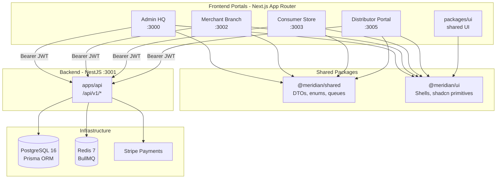
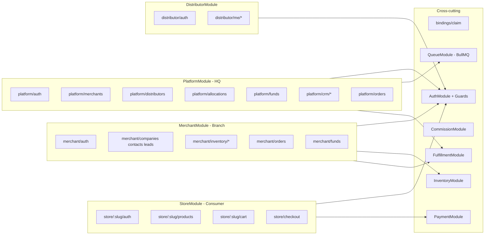
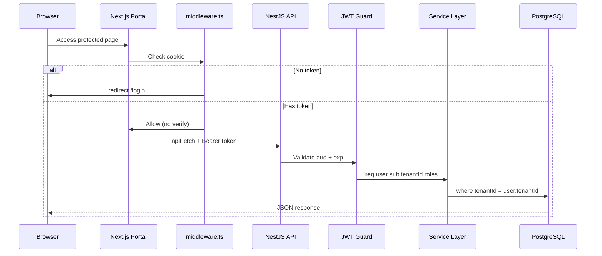
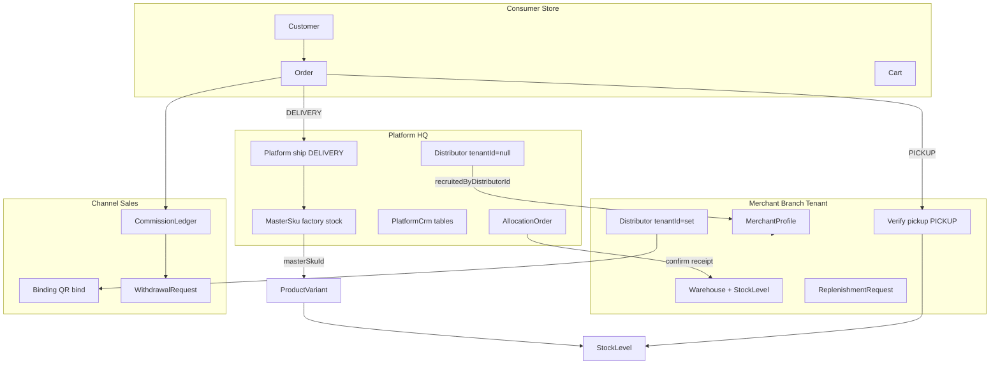
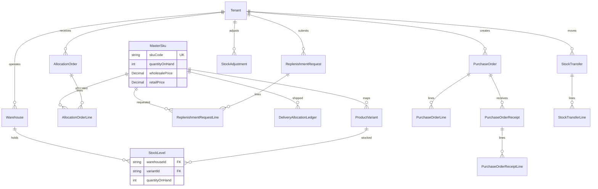

# MeridianERP System Overview

**Version:** 1.0  
**Last updated:** 2025-06-27  
**Status:** Canonical architecture reference  
**Source of truth (data model):** [`apps/api/prisma/schema.prisma`](../../apps/api/prisma/schema.prisma)

MeridianERP is a **multi-tenant SaaS ERP** for factory HQ → merchant branches → B2B channel distributors → consumer storefronts. One NestJS monolith API serves four Next.js portals. Shared contracts live in `@meridian/shared`; shared UI in `@meridian/ui`.

**Related docs**

| Document | Focus |
|----------|-------|
| [Phase 1 Foundation](./phase-1-foundation.md) | Auth, tenant scoping, Phase 1 schema |
| [Phase 2 E-commerce](./phase-2-ecommerce.md) | Store, orders, commission |
| [Phase 3 Inventory](./phase-3-inventory.md) | Warehouses, POs, stock |
| [Phase 5 Distribution & Allocation](./phase-5-distribution-and-allocation.md) | HQ ↔ branch, allocation, fulfillment split |
| [Platform Design Spec](../superpowers/specs/2025-06-24-meridianerp-platform-design.md) | Original Phase 1 specification |
| [功能报告](../reports/功能报告.md) | Chinese business feature report |

---

## 1. System Architecture (High Level)

Monorepo layout: **frontend portals → shared packages → NestJS API → infrastructure**.



### Apps and ports

| App | Package | Port | Audience |
|-----|---------|------|----------|
| Admin | `@meridian/admin` | 3000 | Platform operators (HQ) |
| API | `@meridian/api` | 3001 | All portals |
| Merchant | `@meridian/merchant` | 3002 | Branch staff |
| Store | `@meridian/store` | 3003 | End customers |
| UI reference | `@meridian/ui` | packages/ui | Shared components and design tokens |
| Distributor | `@meridian/distributor` | 3005 | Channel partners |

### Key decisions

- **Monorepo:** pnpm workspaces + Turborepo; `rtk pnpm dev` runs API + all portals.
- **Docker Compose:** postgres, redis, api, admin, merchant, store (`docker/docker-compose.yml`); distributor runs locally only.
- **Redis:** BullMQ job broker only; `@nestjs/cache-manager` is not wired.
- **Contracts:** DTOs and enums in `packages/shared`; UI patterns canonical in `packages/ui`.

---

## 2. API Module Detail

NestJS root module imports domain modules; `TenantInterceptor` is global.



### Route namespaces

| Module | Prefix | Examples |
|--------|--------|----------|
| Platform | `/api/v1/platform/*` | merchants, distributors, allocations, funds, crm, orders, settlements |
| Merchant | `/api/v1/merchant/*` | auth, onboarding, inventory, orders, funds, replenishment |
| Store | `/api/v1/store/:slug/*` | products, cart, checkout, orders, bindings |
| Distributor | `/api/v1/distributor/*` | auth, me/commissions, me/withdrawals |
| Bindings | `/api/v1/bindings/*` | claim (QR bind flow) |

### BullMQ queues

| Queue | Job names | Trigger |
|-------|-----------|---------|
| `email` | `merchant.welcome`, `merchant.rejected`, `distributor.binding.created`, `commission.accrued`, `order.confirmation` | Various lifecycle events |
| `commission` | `order.accrue` | Order reaches `FULFILLED` (not `PAID`) |

---

## 3. Authentication & Request Flow

Four isolated JWT realms; Next.js middleware checks cookies only (no signature validation); API validates Bearer tokens.



### JWT realms

| Realm | aud | Cookie | API prefix | Secret env |
|-------|-----|--------|------------|------------|
| Platform | `admin` | `admin_token` | `/platform/*` | `JWT_SECRET` |
| Merchant | `merchant` | `merchant_token` | `/merchant/*` | `JWT_MERCHANT_SECRET` |
| Store | `store` | `store_token` | `/store/:slug/*` | `JWT_STORE_SECRET` |
| Distributor | `distributor` | `distributor_token` | `/distributor/*` | `JWT_DISTRIBUTOR_SECRET` |

**JWT payload:** `{ sub, aud, tenantId?, roles[], iat, exp }` — 8h expiry.

### Multi-tenancy enforcement

- Shared PostgreSQL database; row-level isolation via `tenantId` on merchant-owned rows.
- `TenantInterceptor` copies `user.tenantId` from JWT onto the request.
- Services filter Prisma queries explicitly: `where: { tenantId }`.
- Platform cross-tenant reads use `@BypassTenant()` with audit logging.
- Per-tenant uniqueness: `(tenantId, email)` on `User` and `Customer`; `(tenantId, slug)` on `Category` and `Product`.

---

## 4. Business Domain Detail (HQ ↔ Branch ↔ Channel)

Phase 5 model: HQ owns factory inventory and ships **DELIVERY** orders; branches hold warehouse stock for **PICKUP** and run distributor trees.



### Order fulfillment split

| fulfillmentType | Fulfilled by | Inventory source | Commission trigger |
|-----------------|--------------|------------------|--------------------|
| `PICKUP` | Merchant (`verify-pickup`) | Branch default `Warehouse` / `StockLevel` | On `FULFILLED` |
| `DELIVERY` | Platform (`ship`) | `MasterSku.quantityOnHand` | On `FULFILLED` |

### Merchant onboarding states

`DRAFT` → `SUBMITTED` → `UNDER_REVIEW` → `APPROVED` | `REJECTED`

On approval: tenant slug provisioned, owner account activated, welcome email queued.

---

## 5. Database Entity Diagrams

**45 Prisma models**, grouped into 4 ER diagrams. Diagrams reflect the live schema only (not planned-but-unmigrated fields from Phase 5 docs).

### 5a. Platform & Tenant Core

Models: `PlatformUser`, `PlatformSettings`, `Tenant`, `MerchantProfile`, `RecruiterChangeLog`, `User`, `TenantSettings`, `TenantInventorySettings`

```mermaid
erDiagram
  PlatformUser ||--o{ AllocationOrder : issues
  PlatformUser ||--o{ WithdrawalRequest : reviews

  Tenant ||--|| MerchantProfile : has
  Tenant ||--|| TenantSettings : has
  Tenant ||--|| TenantInventorySettings : has
  Tenant ||--o{ User : employs

  MerchantProfile }o--o| Distributor : recruitedBy
  MerchantProfile ||--o{ RecruiterChangeLog : audit

  PlatformSettings {
    string id PK
    string platformName
    boolean distributorPortalEnabled
    boolean emailQueueEnabled
  }

  Tenant {
    string id PK
    string slug UK
  }

  MerchantProfile {
    string tenantId UK_FK
    OnboardingStatus onboardingStatus
    boolean storePublished
    string recruitedByDistributorId FK
  }
```

### 5b. CRM & Channel Distribution

Models: `CrmCompany`, `CrmContact`, `CrmLead`, `CrmActivity`, `Distributor`, `DistributorQrCode`, `MerchantRecruitInviteCode`, `Binding`, `WithdrawalRequest`, `PlatformCrmCompany`, `PlatformCrmContact`, `PlatformCrmLead`

```mermaid
erDiagram
  Tenant ||--o{ CrmCompany : owns
  CrmCompany ||--o{ CrmContact : has
  CrmContact ||--o{ CrmLead : generates
  CrmContact ||--o{ CrmActivity : logs
  CrmLead }o--o| Distributor : attributed

  Distributor }o--o| Tenant : scoped
  Distributor ||--o{ DistributorQrCode : generates
  Distributor ||--o{ MerchantRecruitInviteCode : issues
  Distributor ||--o{ Binding : binds
  Distributor ||--o{ WithdrawalRequest : requests
  Distributor ||--o{ CommissionLedger : earns

  Binding }o--|| Tenant : belongs

  PlatformCrmCompany ||--o{ PlatformCrmContact : has
  PlatformCrmContact ||--o{ PlatformCrmLead : generates

  Distributor {
    string id PK
    string tenantId FK_nullable
    Decimal commissionRate
    CommissionType commissionType
    boolean portalEnabled
  }

  Binding {
    string tenantId FK
    string distributorId FK
    BindType bindableType
    string bindableId
  }
```

### 5c. E-commerce & Commission

Models: `Customer`, `Category`, `Product`, `ProductVariant`, `Cart`, `CartItem`, `Order`, `OrderLine`, `CommissionLedger`, `SettlementBatch`, `DeliveryAllocationLedger`

```mermaid
erDiagram
  Tenant ||--o{ Customer : serves
  Tenant ||--o{ Category : categorizes
  Category ||--o{ Product : contains
  Product ||--o{ ProductVariant : has
  ProductVariant }o--o| MasterSku : links

  Customer ||--o{ Cart : owns
  Customer ||--o{ Order : places
  Cart ||--o{ CartItem : contains
  CartItem }o--|| ProductVariant : references
  Cart }o--o| Distributor : attributed

  Order ||--o{ OrderLine : contains
  Order }o--o| Distributor : attributed
  Order ||--o| CommissionLedger : generates
  Order ||--o{ DeliveryAllocationLedger : delivery

  CommissionLedger }o--o| SettlementBatch : batched
  CommissionLedger }o--|| Distributor : pays

  Order {
    string id PK
    string tenantId FK
    OrderStatus status
    FulfillmentType fulfillmentType
    string stripePaymentIntentId UK
    string pickupCode UK
  }

  CommissionLedger {
    string orderId UK_FK
    string distributorId FK
    LedgerStatus status
    Decimal amount
  }
```

### 5d. Inventory & Factory Allocation

Models: `Warehouse`, `StockLevel`, `StockAdjustment`, `PurchaseOrder`, `PurchaseOrderLine`, `PurchaseOrderReceipt`, `PurchaseOrderReceiptLine`, `StockTransfer`, `StockTransferLine`, `MasterSku`, `AllocationOrder`, `AllocationOrderLine`, `ReplenishmentRequest`, `ReplenishmentRequestLine`



### Domain coverage summary

| Domain | Models | Tenant scope |
|--------|--------|--------------|
| Platform auth & settings | 2 | Global |
| Tenant & merchant | 5 | Tenant root |
| Merchant CRM | 4 | `tenantId` |
| Platform CRM | 3 | Global |
| Channel distribution | 5 | Mixed (`Distributor.tenantId` nullable) |
| E-commerce | 8 | `tenantId` |
| Commission settlement | 2 | Mixed |
| Branch inventory | 9 | `tenantId` |
| Factory allocation | 6 | `MasterSku` global; rest `tenantId` |

---

## 6. Appendix — Enums

| Enum | Values | Used by |
|------|--------|---------|
| `OnboardingStatus` | DRAFT, SUBMITTED, UNDER_REVIEW, APPROVED, REJECTED | MerchantProfile |
| `LeadStage` | NEW, QUALIFIED, WON, LOST | CrmLead, PlatformCrmLead |
| `ActivityType` | CALL, NOTE, MEETING | CrmActivity |
| `CommissionType` | PERCENT, FIXED | Distributor, TenantSettings |
| `BindType` | MERCHANT, CUSTOMER | DistributorQrCode, Binding |
| `PlatformRole` | SUPER_ADMIN, PLATFORM_OPS | PlatformUser |
| `MerchantRole` | MERCHANT_OWNER, MERCHANT_STAFF | User |
| `OrderStatus` | PENDING_PAYMENT, PAID, FULFILLED, CANCELLED, REFUNDED | Order |
| `LedgerStatus` | ACCRUED, SETTLED, VOID | CommissionLedger |
| `SettlementBatchStatus` | DRAFT, EXPORTED, PAID | SettlementBatch |
| `PurchaseOrderStatus` | DRAFT, ORDERED, PARTIALLY_RECEIVED, RECEIVED, CANCELLED | PurchaseOrder |
| `StockAdjustmentReason` | DAMAGE, COUNT_CORRECTION, RETURN, TRANSFER_OUT, TRANSFER_IN, OTHER | StockAdjustment |
| `StockTransferStatus` | COMPLETED, CANCELLED | StockTransfer |
| `FulfillmentType` | PICKUP, DELIVERY | Order |
| `AllocationOrderStatus` | DRAFT, ISSUED, CONFIRMED, CANCELLED | AllocationOrder |
| `ReplenishmentRequestStatus` | PENDING, APPROVED, REJECTED, FULFILLED | ReplenishmentRequest |
| `WithdrawalRequestStatus` | PENDING, APPROVED, REJECTED | WithdrawalRequest |

---

## 7. Appendix — Model Field Reference

All fields from `schema.prisma`. PK = primary key, UK = unique, FK = foreign key.

### Platform auth & settings

#### PlatformUser

| Field | Type | Notes |
|-------|------|-------|
| id | String | PK, cuid |
| email | String | UK |
| password | String | hashed |
| role | PlatformRole | SUPER_ADMIN \| PLATFORM_OPS |
| createdAt, updatedAt | DateTime | |

#### PlatformSettings

| Field | Type | Notes |
|-------|------|-------|
| id | String | PK, default `"singleton"` |
| platformName | String | default MeridianERP |
| supportEmail | String? | |
| distributorPortalEnabled | Boolean | default true |
| emailQueueEnabled | Boolean | default true |
| updatedAt | DateTime | |

### Tenant & merchant

#### Tenant

| Field | Type | Notes |
|-------|------|-------|
| id | String | PK, cuid |
| slug | String | UK — store URL segment |
| createdAt, updatedAt | DateTime | |

#### MerchantProfile

| Field | Type | Notes |
|-------|------|-------|
| id | String | PK |
| tenantId | String | UK, FK → Tenant |
| businessName | String | |
| legalName | String? | |
| contactEmail | String | |
| contactPhone | String? | |
| onboardingStatus | OnboardingStatus | default DRAFT |
| rejectionReason | String? | |
| submittedAt, reviewedAt | DateTime? | |
| recruitedByDistributorId | String? | FK → Distributor |
| recruitedAt | DateTime? | |
| pendingRecruitInviteCode | String? | |
| storePublished | Boolean | default false |
| createdAt, updatedAt | DateTime | |
| | | Index: recruitedByDistributorId |

#### RecruiterChangeLog

| Field | Type | Notes |
|-------|------|-------|
| id | String | PK |
| merchantProfileId | String | FK → MerchantProfile |
| previousDistributorId | String? | |
| newDistributorId | String? | |
| reason | String | |
| changedByPlatformUserId | String? | |
| createdAt | DateTime | |

#### User (merchant staff)

| Field | Type | Notes |
|-------|------|-------|
| id | String | PK |
| tenantId | String | FK → Tenant |
| email | String | UK with tenantId |
| password | String | |
| role | MerchantRole | |
| createdAt, updatedAt | DateTime | |

#### TenantSettings

| Field | Type | Notes |
|-------|------|-------|
| tenantId | String | PK, FK → Tenant |
| defaultCommissionRate | Decimal(10,4)? | |
| defaultCommissionType | CommissionType? | |
| notifyOnBinding | Boolean | default true |
| notifyOnCommission | Boolean | default true |
| createdAt, updatedAt | DateTime | |

#### TenantInventorySettings

| Field | Type | Notes |
|-------|------|-------|
| tenantId | String | PK, FK → Tenant |
| defaultReorderThreshold | Int | default 5 |
| createdAt, updatedAt | DateTime | |

### Merchant CRM

#### CrmCompany

| Field | Type | Notes |
|-------|------|-------|
| id | String | PK |
| tenantId | String | FK, index |
| name | String | |
| website | String? | |
| createdAt, updatedAt | DateTime | |

#### CrmContact

| Field | Type | Notes |
|-------|------|-------|
| id | String | PK |
| tenantId | String | FK, index |
| companyId | String? | FK → CrmCompany |
| firstName, lastName | String | |
| email, phone | String? | |
| createdAt, updatedAt | DateTime | |

#### CrmLead

| Field | Type | Notes |
|-------|------|-------|
| id | String | PK |
| tenantId | String | FK, index |
| contactId | String? | FK → CrmContact |
| title | String | |
| stage | LeadStage | default NEW, index |
| source | String? | |
| distributorId | String? | FK → Distributor |
| createdAt, updatedAt | DateTime | |

#### CrmActivity

| Field | Type | Notes |
|-------|------|-------|
| id | String | PK |
| tenantId | String | FK, index |
| contactId | String? | FK → CrmContact |
| leadId | String? | no FK relation |
| type | ActivityType | |
| note | String | |
| createdAt | DateTime | |

### Platform CRM

#### PlatformCrmCompany

| Field | Type | Notes |
|-------|------|-------|
| id | String | PK |
| name | String | |
| website | String? | |
| createdAt, updatedAt | DateTime | |

#### PlatformCrmContact

| Field | Type | Notes |
|-------|------|-------|
| id | String | PK |
| companyId | String? | FK → PlatformCrmCompany |
| firstName, lastName | String | |
| email, phone | String? | |
| createdAt, updatedAt | DateTime | |

#### PlatformCrmLead

| Field | Type | Notes |
|-------|------|-------|
| id | String | PK |
| contactId | String? | FK → PlatformCrmContact |
| title | String | |
| stage | LeadStage | index |
| source | String? | |
| createdAt, updatedAt | DateTime | |

### Channel distribution

#### Distributor

| Field | Type | Notes |
|-------|------|-------|
| id | String | PK |
| tenantId | String? | FK nullable — null = HQ agent |
| name | String | |
| email, phone | String? | |
| passwordHash | String? | portal login |
| portalEnabled | Boolean | default false |
| lastLoginAt | DateTime? | |
| commissionRate | Decimal(10,4) | |
| commissionType | CommissionType | default PERCENT |
| isActive | Boolean | default true |
| createdAt, updatedAt | DateTime | |

#### MerchantRecruitInviteCode

| Field | Type | Notes |
|-------|------|-------|
| id | String | PK |
| code | String | UK |
| distributorId | String | FK |
| revokedAt, expiresAt | DateTime? | |
| useCount | Int | default 0 |
| createdAt | DateTime | |

#### DistributorQrCode

| Field | Type | Notes |
|-------|------|-------|
| id | String | PK |
| distributorId | String | FK |
| token | String | UK |
| bindType | BindType | default MERCHANT |
| expiresAt | DateTime | |
| revokedAt | DateTime? | |
| createdAt | DateTime | |

#### Binding

| Field | Type | Notes |
|-------|------|-------|
| id | String | PK |
| tenantId | String | FK |
| distributorId | String | FK |
| bindableType | BindType | |
| bindableId | String | |
| boundAt | DateTime | |
| | | UK: (bindableType, bindableId) |

#### WithdrawalRequest

| Field | Type | Notes |
|-------|------|-------|
| id | String | PK |
| distributorId | String | FK |
| amount | Decimal(12,2) | |
| status | WithdrawalRequestStatus | default PENDING |
| note | String? | |
| reviewedByPlatformUserId | String? | |
| rejectionReason | String? | |
| reviewedAt | DateTime? | |
| createdAt, updatedAt | DateTime | |

### E-commerce

#### Customer

| Field | Type | Notes |
|-------|------|-------|
| id | String | PK |
| tenantId | String | FK |
| email | String | UK with tenantId |
| password | String | |
| firstName, lastName | String? | |
| createdAt, updatedAt | DateTime | |

#### Category

| Field | Type | Notes |
|-------|------|-------|
| id | String | PK |
| tenantId | String | FK |
| parentId | String? | self-FK tree |
| name, slug | String | UK: (tenantId, slug) |
| createdAt, updatedAt | DateTime | |

#### Product

| Field | Type | Notes |
|-------|------|-------|
| id | String | PK |
| tenantId | String | FK |
| categoryId | String? | FK |
| name, slug | String | UK: (tenantId, slug) |
| description | String? | |
| isPublished | Boolean | default false |
| createdAt, updatedAt | DateTime | |

#### ProductVariant

| Field | Type | Notes |
|-------|------|-------|
| id | String | PK |
| productId | String | FK, cascade delete |
| masterSkuId | String? | FK → MasterSku |
| sku, name | String | UK: (productId, sku) |
| price | Decimal(12,2) | |
| inventory | Int | legacy/cache field |
| reorderThreshold | Int? | |
| isActive | Boolean | default true |
| createdAt, updatedAt | DateTime | |

#### Cart

| Field | Type | Notes |
|-------|------|-------|
| id | String | PK |
| tenantId | String | FK |
| customerId | String? | FK |
| sessionId | String? | guest cart |
| distributorId | String? | attribution |
| createdAt, updatedAt | DateTime | |

#### CartItem

| Field | Type | Notes |
|-------|------|-------|
| id | String | PK |
| cartId | String | FK, cascade delete |
| variantId | String | FK |
| quantity | Int | default 1 |
| createdAt, updatedAt | DateTime | |
| | | UK: (cartId, variantId) |

#### Order

| Field | Type | Notes |
|-------|------|-------|
| id | String | PK |
| tenantId | String | FK |
| customerId | String? | FK |
| distributorId | String? | FK, attribution |
| status | OrderStatus | default PENDING_PAYMENT |
| fulfillmentType | FulfillmentType | default PICKUP |
| currency | String | default CNY |
| subtotal, tax, total | Decimal(12,2) | |
| guestEmail | String? | |
| stripePaymentIntentId | String? | UK |
| pickupCode | String? | UK |
| pickupVerifiedAt | DateTime? | |
| pickupVerifiedByUserId | String? | |
| deliveryAddress | Json? | |
| shippedAt | DateTime? | |
| shippedByPlatformUserId | String? | |
| createdAt, updatedAt | DateTime | |

#### OrderLine

| Field | Type | Notes |
|-------|------|-------|
| id | String | PK |
| orderId | String | FK, cascade delete |
| variantId | String? | FK |
| productName, variantName | String | snapshot |
| quantity | Int | |
| unitPrice, lineTotal | Decimal(12,2) | |

### Commission settlement

#### CommissionLedger

| Field | Type | Notes |
|-------|------|-------|
| id | String | PK |
| tenantId | String | FK |
| orderId | String | UK, FK → Order |
| distributorId | String | FK |
| amount | Decimal(12,2) | |
| status | LedgerStatus | default ACCRUED |
| settlementBatchId | String? | FK |
| settledAt | DateTime? | |
| createdAt, updatedAt | DateTime | |

#### SettlementBatch

| Field | Type | Notes |
|-------|------|-------|
| id | String | PK |
| periodStart, periodEnd | DateTime | |
| status | SettlementBatchStatus | default DRAFT |
| exportedAt | DateTime? | |
| createdAt, updatedAt | DateTime | |

#### DeliveryAllocationLedger

| Field | Type | Notes |
|-------|------|-------|
| id | String | PK |
| orderId | String | FK |
| tenantId | String | FK |
| masterSkuId | String | FK |
| quantity | Int | |
| wholesalePrice, lineTotal | Decimal(12,2) | |
| createdAt | DateTime | |

### Branch inventory

#### Warehouse

| Field | Type | Notes |
|-------|------|-------|
| id | String | PK |
| tenantId | String | FK |
| name | String | |
| address | String? | |
| isDefault | Boolean | default false |
| isActive | Boolean | default true |
| createdAt, updatedAt | DateTime | |

#### StockLevel

| Field | Type | Notes |
|-------|------|-------|
| id | String | PK |
| tenantId | String | FK |
| warehouseId | String | FK |
| variantId | String | FK |
| quantityOnHand | Int | default 0 |
| createdAt, updatedAt | DateTime | |
| | | UK: (warehouseId, variantId) |

#### StockAdjustment

| Field | Type | Notes |
|-------|------|-------|
| id | String | PK |
| tenantId | String | FK |
| warehouseId | String | FK |
| variantId | String | FK |
| actorId | String | FK → User |
| reason | StockAdjustmentReason | |
| note | String? | |
| quantityDelta | Int | |
| quantityBefore, quantityAfter | Int | |
| createdAt | DateTime | |

#### PurchaseOrder

| Field | Type | Notes |
|-------|------|-------|
| id | String | PK |
| tenantId | String | FK |
| warehouseId | String | FK |
| supplierName | String | |
| status | PurchaseOrderStatus | default DRAFT |
| poNumber | String | UK with tenantId |
| createdById | String | FK → User |
| orderedAt | DateTime? | |
| createdAt, updatedAt | DateTime | |

#### PurchaseOrderLine

| Field | Type | Notes |
|-------|------|-------|
| id | String | PK |
| purchaseOrderId | String | FK, cascade |
| variantId | String | FK |
| quantityOrdered | Int | |
| quantityReceived | Int | default 0 |
| createdAt, updatedAt | DateTime | |
| | | UK: (purchaseOrderId, variantId) |

#### PurchaseOrderReceipt

| Field | Type | Notes |
|-------|------|-------|
| id | String | PK |
| tenantId | String | FK |
| purchaseOrderId | String | FK |
| receivedById | String | FK → User |
| note | String? | |
| createdAt | DateTime | |

#### PurchaseOrderReceiptLine

| Field | Type | Notes |
|-------|------|-------|
| id | String | PK |
| receiptId | String | FK, cascade |
| purchaseOrderLineId | String | FK |
| quantityReceived | Int | |

#### StockTransfer

| Field | Type | Notes |
|-------|------|-------|
| id | String | PK |
| tenantId | String | FK |
| fromWarehouseId | String | FK |
| toWarehouseId | String | FK |
| status | StockTransferStatus | default COMPLETED |
| note | String? | |
| createdById | String | FK → User |
| createdAt | DateTime | |

#### StockTransferLine

| Field | Type | Notes |
|-------|------|-------|
| id | String | PK |
| transferId | String | FK, cascade |
| variantId | String | FK |
| quantity | Int | |

### Factory allocation

#### MasterSku

| Field | Type | Notes |
|-------|------|-------|
| id | String | PK |
| skuCode | String | UK |
| name | String | |
| quantityOnHand | Int | default 0 |
| cumulativeShippedQty | Int | default 0 |
| unitCost | Decimal(12,2) | |
| wholesalePrice | Decimal(12,2) | |
| retailPrice | Decimal(12,2) | |
| isActive | Boolean | default true |
| createdAt, updatedAt | DateTime | |

#### AllocationOrder

| Field | Type | Notes |
|-------|------|-------|
| id | String | PK |
| tenantId | String | FK — target branch |
| status | AllocationOrderStatus | default DRAFT |
| issuedAt, confirmedAt | DateTime? | |
| issuedByPlatformUserId | String? | |
| confirmedByUserId | String? | |
| note | String? | |
| createdAt, updatedAt | DateTime | |

#### AllocationOrderLine

| Field | Type | Notes |
|-------|------|-------|
| id | String | PK |
| allocationOrderId | String | FK, cascade |
| masterSkuId | String | FK |
| quantity | Int | |
| wholesalePrice | Decimal(12,2) | |

#### ReplenishmentRequest

| Field | Type | Notes |
|-------|------|-------|
| id | String | PK |
| tenantId | String | FK — requesting branch |
| status | ReplenishmentRequestStatus | default PENDING |
| note | String? | |
| rejectionReason | String? | |
| reviewedAt | DateTime? | |
| reviewedByPlatformUserId | String? | |
| createdAt, updatedAt | DateTime | |

#### ReplenishmentRequestLine

| Field | Type | Notes |
|-------|------|-------|
| id | String | PK |
| replenishmentRequestId | String | FK, cascade |
| masterSkuId | String | FK |
| quantity | Int | |

---

## Migration history

| Migration | Purpose |
|-----------|---------|
| `20250624120000_init` | Core tenancy, merchants, CRM, distributors, bindings |
| `20250624180000_phase2_ecommerce` | Customers, catalog, carts, orders, commission |
| `20250624200000_phase3_inventory` | Warehouses, stock, POs; tenant backfill |
| `20250625120000_distributor_qr_revoked_at` | QR revocation |
| `20250625140000_commission_performance_indexes` | Tenant-scoped reporting indexes |
| `20260625044035_gaps_epic_*` | TenantSettings, PlatformSettings, stock transfers |
| `20260625120000_phase5_hq_branch_channel` | Nullable distributor tenant, fulfillment fields |
