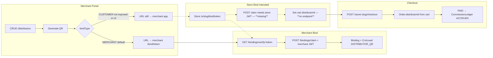

# Test Report: Platform Loop (Phases 1–2 P0)

**Date:** 2025-06-25  
**Engineer:** test-engineer  
**Scope:** P0 acceptance criteria from `PRODUCT.md`, `phase-1-foundation.md`, `phase-2-ecommerce.md`

---

## Executive Summary

| Layer | Command | Result |
|-------|---------|--------|
| API e2e | `rtk pnpm --filter @meridian/api test:e2e` | **PASS** — 12 suites, **47** tests |
| Store typecheck | `rtk pnpm --filter @meridian/store exec tsc --noEmit` | **PASS** |
| Admin typecheck | `rtk pnpm --filter @meridian/admin exec tsc --noEmit` | **PASS** |
| Merchant typecheck | `rtk pnpm --filter @meridian/merchant exec tsc --noEmit` | **PASS** |

**Bottom line:** Backend P0 contracts are green including Phase 4 Slice 1 (US-4.1 / G-7). Portal typecheck passes. Guest checkout SSR cart session (G-6) and Playwright bind UI smoke remain open.

---

## Automated Test Run Details

### API e2e (`apps/api/test/*.e2e-spec.ts`)

| Suite | Tests | Status |
|-------|-------|--------|
| `platform-auth.e2e-spec.ts` | 2 | PASS |
| `merchant-onboarding.e2e-spec.ts` | 3 | PASS |
| `crm.e2e-spec.ts` | 2 | PASS |
| `bindings.e2e-spec.ts` | 7 | PASS |
| `store-catalog.e2e-spec.ts` | 5 | PASS |
| `store-auth.e2e-spec.ts` | 6 | PASS |
| `store-checkout.e2e-spec.ts` | 5 | PASS |
| `inventory-warehouses.e2e-spec.ts` | 4 | PASS |
| `inventory-adjustments.e2e-spec.ts` | 4 | PASS |
| `inventory-purchase-orders.e2e-spec.ts` | 4 | PASS |
| `inventory-reports.e2e-spec.ts` | 3 | PASS |
| `app.e2e-spec.ts` | 1 | PASS |

Playwright suites (`e2e/phase-1.spec.ts`, `phase-2-store.spec.ts`, `phase-3-inventory.spec.ts`) were **not re-run** in this loop; prior PRD notes API-only smoke for Phase 2.

---

## P0 Acceptance Criteria Matrix

### Phase 1 — Foundation

| ID | Criterion (summary) | API Test | UI / Integration | Overall |
|----|---------------------|----------|------------------|---------|
| US-1 | Platform admin login | `platform-auth.e2e-spec.ts` | Admin login page exists; no dedicated UI e2e this run | **PASS** |
| US-2 | Merchant registration | `merchant-onboarding.e2e-spec.ts` | Register wizard wired | **PASS** |
| US-3 | Approve/reject merchants | `merchant-onboarding.e2e-spec.ts` (reject) | Admin reject now sends `{ reason }` — **G-1 fixed** | **PASS** |
| US-4 | Merchant login after approval | onboarding e2e | Login page wired | **PASS** |
| US-5 | CRM contacts/companies CRUD | `crm.e2e-spec.ts` | Merchant CRM pages | **PASS** |
| US-6 | Lead pipeline stages | `crm.e2e-spec.ts` | Merchant leads page | **PASS** |
| US-7 | CRM activities (P1) | `crm.e2e-spec.ts` | `/crm/activities` UI added — **G-10 fixed** | **PASS** |
| US-8 | Distributor + commission settings | `bindings.e2e-spec.ts` (CRUD) | `/distributors` CRUD table | **PASS** |
| US-9 | Distributor QR generation | `bindings.e2e-spec.ts` | QR display on distributor detail | **PASS** |
| US-10 | Merchant QR bind claim | `bindings.e2e-spec.ts` | `/bind/[token]` merchant page | **PASS** (merchant bind only) |
| US-11 | Cross-tenant merchant list (P1) | — | Filters sent to API but **API ignores `status`/`search`** (G-2) | **FAIL** |
| US-12 | RBAC staff vs owner (P1) | — | No automated test; partial enforcement | **PARTIAL** |

### Phase 2 — E-commerce

| ID | Criterion (summary) | API Test | UI / Integration | Overall |
|----|---------------------|----------|------------------|---------|
| US-2.1 | Product/category CRUD | `store-catalog.e2e-spec.ts` | Merchant catalog pages | **PASS** |
| US-2.2 | Customer register/login | `store-auth.e2e-spec.ts` | Store login/register | **PASS** |
| US-2.3 | Cart + checkout → PAID | `store-checkout.e2e-spec.ts` | Checkout path fixed (`storePath`); **guest SSR cart session missing on checkout page** (G-6 partial); no Stripe UI (G-9) | **FAIL** |
| US-2.4 | Distributor attribution at checkout | `store-checkout.e2e-spec.ts` — *accrues commission after store customer bind claim (US-4.1)*; `bindings.e2e-spec.ts` — CUSTOMER claim + cart | Store bind UI wired; Playwright smoke pending | **PASS** (API) |
| US-2.5 | Commission on PAID | `store-checkout.e2e-spec.ts` | N/A (backend) | **PASS** |
| US-2.6 | Settlement ledger + export (P1) | — | Admin settlements UI | **PASS** (manual) |
| US-2.7 | Inventory decrement on PAID (P1) | `store-checkout.e2e-spec.ts` | N/A | **PASS** |

---

## Distributor Flow Map

| Step | API | Merchant UI | Store UI | Status |
|------|-----|-------------|----------|--------|
| Create distributor + commission | `POST /merchant/distributors` | `/distributors` table + dialog | — | ✅ |
| Update/delete distributor | `PATCH` / `DELETE` | Table actions | — | ✅ |
| Generate QR | `POST /merchant/distributors/:id/qr` | `QrDisplay` (no bindType picker) | — | ⚠️ MERCHANT-only URL |
| Verify token | `GET /bindings/verify/:token` | Bind pages | Bind pages | ⚠️ Returns `{valid, distributorId, bindType}` — UI expects `distributorName`, `requiresAuth` |
| Claim binding | `POST /bindings/claim` (merchant JWT); `POST /store/:slug/bindings/claim` (store JWT) | `/bind/[token]` | `/s/[slug]/bind/[token]` | ✅ merchant · ✅ store customer (**G-7 fixed**) |
| Attribution on cart | Cart model `distributorId` set on claim | — | Lazy hydrate on cart resolve | ✅ |
| Commission on order | `CommissionService` on PAID | — | — | ✅ API |
| Settlement export | `GET /platform/settlements` | Admin settlements | — | ✅ |

---

## Bug List (Prioritized)

### P0 — Blocks release / P0 criteria

| ID | Area | Issue | Evidence |
|----|------|-------|----------|
| ~~**B-P0-1**~~ | `@meridian/ui` | Sidebar TS regression — **FIXED** (admin/merchant/store `tsc` pass) | verified 2025-06-25 |
| **B-P0-2** | Store checkout | Checkout **SSR** loads cart with JWT only; guest `X-Cart-Session` not forwarded (cart page fixed, checkout page not) | `apps/store/app/s/[slug]/checkout/page.tsx:14` vs cart page using `getServerCartSession` |
| ~~**B-P0-3**~~ | Store distributor bind | ~~Merchant-only claim~~ — **FIXED** via `POST /store/:slug/bindings/claim` | `store-bindings.controller.ts` |
| ~~**B-P0-4**~~ | Store distributor bind | ~~No cart attribution~~ — **FIXED** on claim + lazy hydrate | `store-cart.service.ts` |
| ~~**B-P0-5**~~ | QR URLs | ~~CUSTOMER QR pointed at merchant app~~ — **FIXED** store URL | `distributors.service.ts` |

### P1 — Important gaps

| ID | Area | Issue | Evidence |
|----|------|-------|----------|
| G-2 | Admin merchants | `status` / `search` query params ignored by `PlatformMerchantsService.list` | `platform-merchants.service.ts:19-37` |
| G-3 | Admin dashboard | No `/platform/dashboard`; `activeDistributors` / `bindingsLast30Days` hardcoded 0 | `apps/admin/app/page.tsx:27-33` |
| G-4 | Admin merchant detail | UI expects `crmSummary` / `distributors`; API returns raw profile | `merchant-detail.tsx:142+` |
| ~~G-7~~ | Bind verify contract | **FIXED** — API returns `BindVerifyResponse` with `distributorName`, `requiresAuth`, `tenantSlug`; store claim endpoint live | `bindings.service.ts`, `store-bindings.controller.ts`; verified `bindings.e2e-spec.ts` |
| G-8 | Store account | Stub; no customer order history API | PRD |
| G-9 | Store payment | No Stripe Payment Element; simulate-payment only | PRD |
| G-12 | Settings | Admin/merchant `/settings` stubs | PRD |

### P2 — Hygiene / tech debt

| ID | Area | Issue | Evidence |
|----|------|-------|----------|
| **B-P2-1** | Merchant app | **Agent debug instrumentation** — `fetch` to `127.0.0.1:7530/ingest/...` in production paths | `apps/merchant/app/page.tsx` (5 regions), `distributors/page.tsx` (1) |
| **B-P2-2** | Merchant dashboard | No `/merchant/dashboard` API; fallback aggregates with debug logs | `apps/merchant/app/page.tsx` |
| **B-P2-3** | API shape | Merchant list endpoints return **raw arrays**; `asList()` helper added but pattern inconsistent across portals | `merchant/lib/api.ts`, `asList()` |
| **B-P2-4** | QR UX | No UI to choose `CUSTOMER` vs `MERCHANT` bind type when generating QR | `qr-display.tsx` — POST without body |
| **B-P2-5** | US-12 | RBAC for distributor write by staff role untested | No e2e |

### Resolved since platform-overview (verified this loop)

| ID | Resolution |
|----|------------|
| G-1 | Admin reject sends `{ reason }` — matches API |
| G-5 | Checkout form uses `storePath(storeSlug, 'checkout')` |
| G-10 | Merchant `/crm/activities` page exists |
| G-11 | Merchant `/orders` page exists |
| G-7 | Store customer bind — `POST /store/:slug/bindings/claim`, enriched verify, CUSTOMER QR URL, cart attribution (Phase 4 Slice 1 / US-4.1) |

---

## Codebase Grep: Known Issue Patterns

| Pattern | Findings |
|---------|----------|
| Agent debug `#region agent log` | **6 blocks** in `apps/merchant/app/page.tsx`, **1** in `distributors/page.tsx` |
| `.data` on arrays | Merchant `asList()` mitigates; admin still uses `res.data` for paginated platform APIs (correct). Inventory e2e uses `body.data` for paginated stock endpoints (correct). Risk: callers assuming `.data` on merchant arrays without `asList` |
| Distributor gaps | See flow map — customer bind + cart attribution is the main hole |

---

## Recommended Next Product Features

1. **Store customer distributor bind (P0)** — Store-scoped claim endpoint (store JWT), verify response enrichment, cart `distributorId` assignment, CUSTOMER QR URLs pointing to `/s/{slug}/bind/{token}`.
2. **Guest checkout completion (P0)** — Fix checkout page SSR cart session; add Stripe Payment Element + order confirmation page.
3. **Fix `@meridian/ui` sidebar TS regression (P0 CI)** — Unblocks portal typecheck and build pipeline.
4. **Remove agent debug instrumentation (P0 hygiene)** — Before any production deploy.
5. **Platform dashboard API (P1)** — Real metrics for merchants, distributors, bindings.
6. **Admin merchant list filters (P1)** — Wire `status` / `search` in `PlatformMerchantsService.list`.
7. **Merchant dashboard API (P1)** — Replace client-side fallback aggregation.
8. **Customer order history + account page (P1)** — Close G-8.
9. **RBAC e2e for US-12 (P1)** — Staff denied distributor write.
10. **Phase 4 candidates (P2)** — Distributor hierarchies, analytics, stock transfers, product images.

---

## Test Coverage Gaps

| Gap | Recommendation |
|-----|----------------|
| No Playwright for store bind / guest checkout UI | Add `e2e/phase-2-store-bind.spec.ts` after G-6 fix (G-7 API done) |
| No settlement export e2e | Add API test for CSV export |
| No platform dashboard test | Add when endpoint exists |
| Portal `tsc` not in CI script explicitly | Add `tsc --noEmit` for admin, merchant, store after UI fix |

---

## Handoff Reference

Detailed engineer handoff: `docs/handoffs/loop-test-engineer.md`
