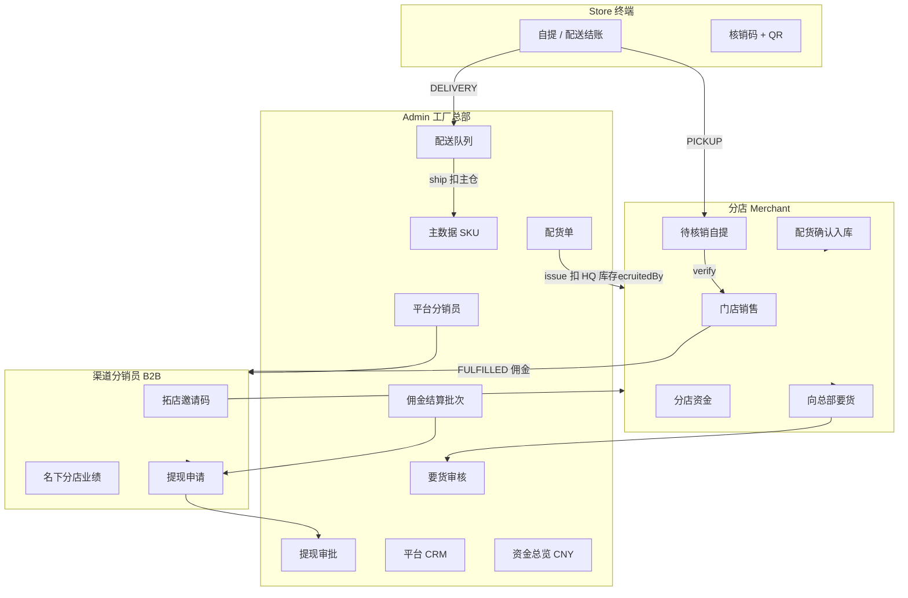

# Phase 5 功能报告 — 工厂总部 · 分店 · 渠道分销员

**版本:** 2.1  
**日期:** 2026-06-25  
**PRD:** `docs/prd/phase-5-distribution-and-allocation.md` v2.0  
**README:** 根目录 `README.md`（英文快速入门 + Phase 5 路由索引）

---

## 1. 业务模型



### 角色职责

| 角色 | 门户 | 核心能力 | 明确不做 |
|------|------|----------|----------|
| **工厂总部** | Admin | 主数据、配货下发、要货审核、分销员 CRUD、分店审核与招募绑定、配送发货、资金/结算/提现、平台 CRM | 不代替分店日常运营 |
| **渠道分销员** | Distributor | 拓店邀请、查看名下分店 GMV、佣金明细、申请提现 | **不**接触终端客户、**不**管理分店后台 |
| **分店** | Merchant | 销售、待核销自提、配货确认、分店资金、要货 | **无**分销员管理（API 403） |
| **终端客户** | Store | 选店、结账选自提/配送、自提凭证 | 无分销员入口 |

---

## 2. 核心规则

### 2.1 招募与佣金

| 规则 | 实现 |
|------|------|
| 分销员创建 | 仅 Admin `POST /platform/distributors`（`tenantId: null`） |
| 拓店邀请 | Admin 生成 6 位码 → `{MERCHANT_URL}/register?invite=CODE`；可 `revoke` |
| 分店绑定 | `MerchantProfile.recruitedByDistributorId`；审核或 `PATCH /platform/merchants/:id/recruiter`（审计 `RecruiterChangeLog`） |
| 佣金计提时机 | 订单 **FULFILLED**（自提核销 / 总部发货），**非** PAID |
| 佣金归属 | 分店 `recruitedByDistributorId` → 平台分销员；**忽略**客户 QR Binding |
| 提现 | 余额 = Σ **SETTLED** 佣金 − Σ 已批准提现；须先 Admin 结算批次导出 ACCRUED |

### 2.2 库存与履约

| 履约方式 | 支付后 | 库存扣减 | 完成条件 |
|----------|--------|----------|----------|
| **总店配送 DELIVERY** | 总部待配送队列；**不扣**分店库存 | 发货时扣 `MasterSku` 主仓 | Admin `POST /platform/orders/:id/ship` → FULFILLED |
| **分店自提 PICKUP** | 待核销列表；**不扣**分店库存 | 核销时扣分店默认仓 | Merchant `POST .../verify-pickup` → FULFILLED |
| **分店配送 DELIVERY** | 分店待配送列表；**不扣**分店库存 | 发货时扣分店默认仓 | Merchant `POST /merchant/orders/:id/ship` → FULFILLED |

总店配送完成时写入 `DeliveryAllocationLedger`（虚拟配货成本）。分店自配送不产生该账本。

### 2.3 配货与要货

| 步骤 | 行为 |
|------|------|
| 总部创建配货单 | `DRAFT` |
| 总部下发 `issue` | `ISSUED`；校验并扣 HQ `quantityOnHand`，增 `cumulativeShippedQty` |
| 分店确认 `confirm` | `CONFIRMED`；分店默认仓库存增加；可自动创建 `Product`/`Variant` |
| 分店要货 | `PENDING` → 总部 `approve` 自动创建并 `issue` 配货单 |

### 2.4 资金公式（CNY，2 位小数）

实现：`packages/shared/src/fund-formulas.ts`

```
分店销售额(GMV)     = Σ Order.total  (PAID | FULFILLED, 日期窗口内)
分店进货成本        = Σ (AllocationOrderLine.quantity × wholesalePrice)  [CONFIRMED]
分店配送虚拟成本    = Σ DeliveryAllocationLedger.lineTotal
应付渠道提成        = Σ CommissionLedger  (ACCRUED | SETTLED, tenantId)
分店净额            = GMV − 进货成本 − 配送成本 − 应付提成

平台批发收入        = 全部分店进货成本 + 全部分店配送虚拟成本
平台 GMV              = Σ 全平台 Order.total
佣金负债              = ACCRUED + SETTLED（窗口内）
待结算佣金            = ACCRUED（须走 /platform/settlements/export）
```

API：`GET /platform/funds/summary?from=&to=`、`GET /merchant/funds/summary?from=&to=`（默认近 30 天）。

---

## 3. 交付切片

### Phase 5 基础（S1–S5）

| 切片 | 状态 | 内容 |
|------|------|------|
| S1 | ✅ | Schema、平台分销员、佣金按 `recruitedByDistributorId` + FULFILLED、禁用 merchant 分销 |
| S2 | ✅ | 拓店邀请注册、Admin 审核绑定、distributor `/branches` |
| S3 | ✅ | MasterSku、配货单、要货、Admin/Merchant 资金 API 与 UI |
| S4 | ✅ | 提现审批、平台/分店资金 dashboard |
| S5 | ✅ | 自提/配送履约、`OrderListFrame`、checkout e2e |

### 成熟 ERP 完善（S6）

| 切片 | 状态 | 内容 |
|------|------|------|
| S6.1 | ✅ | 修复平台 wholesale 聚合；日期范围；CNY UI；Funds/Withdrawals → 结算引导 |
| S6.2 | ✅ | issue 扣 HQ 库存；platform replenishment；merchant 配货确认页 |
| S6.3 | ✅ | invite revoke；recruiter 变更审计；Admin 分销员编辑/门户；merchant 分销页重定向 |
| S6.4 | ✅ | Admin `OrderListFrame` + `DeliveryShipDialog`；Store QR；核销 redact；QR 扫描 |
| S6.5 | ✅ | 平台 CRM API + Admin `/crm/*` |
| S6.6 | ✅ | `phase-5-platform.e2e-spec.ts`；本报告 v2.1 |

---

## 4. API 端点索引

### 4.1 平台（Admin）

| 模块 | 端点 |
|------|------|
| 资金 | `GET /platform/funds/summary?from=&to=` |
| 配货 | `GET/POST/PATCH /platform/allocations/master-skus`；`GET/POST /platform/allocations`；`POST .../:id/issue` |
| 要货 | `GET /platform/replenishment?status=`；`POST .../:id/approve`；`POST .../:id/reject` |
| 分销员 | `GET/POST/PATCH /platform/distributors`；`GET :id`；`POST :id/portal`；`POST :id/invite-code`；`POST :id/invite-code/:codeId/revoke`；`GET :id/branches` |
| 分店 | `POST /platform/merchants/:id/approve`；`PATCH .../recruiter` |
| 订单 | `GET /platform/orders?fulfillmentType=DELIVERY&status=PAID`；`GET :id`；`POST :id/ship` |
| CRM | `GET/POST/PATCH/DELETE /platform/crm/{companies,contacts,leads}` |
| 结算/提现 | `GET/POST /platform/settlements/*`；`GET/POST /platform/withdrawals/*` |

### 4.2 分店（Merchant）

| 模块 | 端点 |
|------|------|
| 资金 | `GET /merchant/funds/summary?from=&to=` |
| 配货 | `GET /merchant/allocations`；`POST /merchant/allocations/:id/confirm` |
| 要货 | `GET/POST /merchant/replenishment`；`GET /merchant/replenishment/master-skus` |
| 订单 | `GET /merchant/orders`；`GET .../pickup-pending`；`POST .../:id/verify-pickup` |
| 分销（禁用） | `/merchant/distributors/*` → **403** |

### 4.3 Store / 分销员

| 端点 | 说明 |
|------|------|
| `POST /store/:slug/checkout` | body: `fulfillmentType`, `deliveryAddress?` |
| `GET /store/:slug/orders/:id/pickup-token` | QR payload（可选 HMAC：`PICKUP_QR_SECRET`） |
| `GET /distributor/me/branches` | 名下分店与 30 日 GMV |
| `GET/POST /distributor/me/withdrawals` | 提现申请与历史 |

---

## 5. 前端页面

| 门户 | 路由 | 说明 |
|------|------|------|
| **Admin** | `/distributors`, `/distributors/[id]` | CRUD、邀请/撤销、门户、编辑费率 |
| | `/allocations` | 主 SKU、配货单创建/下发 |
| | `/replenishment` | 要货审核队列 |
| | `/funds` | CNY KPI、日期范围、GMV 趋势、跳转结算 |
| | `/settlements`, `/withdrawals` | 佣金结算批次、提现审批 |
| | `/orders` | 全量 + **配送** tab、`DeliveryShipDialog` |
| | `/crm/companies`, `/contacts`, `/leads` | 平台 CRM |
| | `/merchants/[id]` | 审核、选择招募分销员 |
| **Merchant** | `/orders` | `OrderListFrame`、待核销 tab、`PickupVerifyDialog` |
| | `/allocations` | 待收货确认 |
| | `/funds`, `/replenishment` | 分店资金、要货 |
| | `/distributors` | 重定向首页（遗留路由） |
| **Distributor** | `/`, `/branches`, `/commissions`, `/withdrawals` | 业绩与提现 |
| **Store** | `/`, `/s/[slug]/checkout` | 店选、自提/配送 |
| | `/s/[slug]/orders/[id]/confirmation` | 核销码 + QR（已核销隐藏） |

### 共享组件（`@meridian/ui`）

- `OrderListFrame` — Admin / Merchant 订单列表共用
- `FulfillmentTypeBadge` — 自提/配送标签
- `PickupVerifyDialog` — 6 位码 + QR 粘贴/扫描核销
- `DeliveryShipDialog` — 总部发货确认
- `packages/shared/src/order-list.ts` — `OrderListRow` 适配类型

---

## 6. 本地开发与验证

| 服务 | 地址 |
|------|------|
| API | http://localhost:3001 |
| Admin | http://localhost:3000 |
| Merchant | http://localhost:3002 |
| Store | http://localhost:3003/s/demo |
| Distributor | http://localhost:3005 |

```bash
rtk pnpm deps          # Redis
rtk pnpm db:setup      # migrate + seed
rtk pnpm dev           # API + 全部门户
```

| 门户 | 种子账号 |
|------|----------|
| Admin | `admin@meridian.test` / `admin123` |
| Merchant | `demo@merchant.test` / `demo1234` |
| Distributor | Admin 创建分销员并开通门户后登录 |

### 测试

| 套件 | 覆盖 |
|------|------|
| `apps/api/test/store-checkout.e2e-spec.ts` | 自提支付不扣库存、核销扣库存、平台分销员佣金、merchant 分销 403 |
| `apps/api/test/phase-5-platform.e2e-spec.ts` | 资金字段、日期范围、配货/要货列表、平台分销员创建、403 |
| `e2e/` Playwright | 部分 smoke（Phase 5 门户待补全） |

---

## 7. 已知遗留

| 项 | 说明 |
|----|------|
| E2E mock Prisma | Phase 5 模型为轻量 stub，完整配货/库存事务需真实 DB 集成测试 |
| Playwright | Admin 配送队列、Merchant 核销、Store 履约选择 smoke 待补 |
| Docker | `docker-compose` 未将 `distributor` 纳入 dev profile |
| 历史数据 | tenant 级旧分销员、客户 QR Binding 表保留只读；新佣金不走此路径 |
| Admin 配货 UI | 主 SKU 行内编辑、配货单状态筛选为 MVP，可继续增强 |
| 币种 | 业务口径 CNY；部分历史 Phase 2/3 页面可能仍显示 USD |

---

## 8. 相关文档

| 文档 | 路径 |
|------|------|
| PRD v2 | `docs/prd/phase-5-distribution-and-allocation.md` |
| 架构 | `docs/architecture/phase-5-distribution-and-allocation.md` |
| 设计 | `docs/design/phase-5-hq-branch-channel.md` |
| UI 展示 | `apps/ui-spec/src/app/page.tsx`（Phase 5 履约区） |
| Handoffs | `docs/handoffs/phase-5-*.md` |
| 执行指南 | `docs/execution/README.md` |
