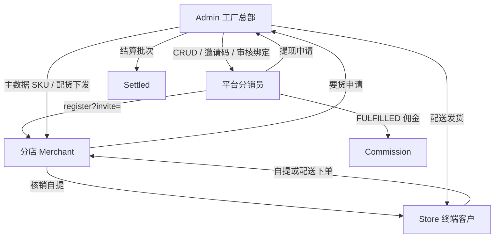

# Phase 5 功能报告 — 工厂总部 · 分店 · 渠道分销员

**版本:** 2.0  
**日期:** 2025-06-25  
**PRD:** `docs/prd/phase-5-distribution-and-allocation.md` v2.0

## 业务模型

| 角色 | 能力 |
|------|------|
| **Admin 工厂总部** | 平台分销员、拓店邀请码与撤销、分店审核/变更招募人、主数据 SKU、配货单（下发扣 HQ 库存）、要货审核、平台 CRM、资金总览（CNY + 日期范围 + GMV 趋势）、配送队列发货、佣金结算、提现审批 |
| **渠道分销员** | 名下分店业绩、佣金明细、申请提现（须先经总部结算批次） |
| **分店 Merchant** | 销售与订单、待核销自提、配货确认收货、分店资金、向总部要货；**无**分销员管理（API 403，页面已重定向） |
| **Store 商城** | 结账选自提/配送；自提展示 6 位核销码 + QR（`pickup-token`）；核销后隐藏凭证 |

## 核心规则

| 规则 | 实现 |
|------|------|
| 招募绑定 | `MerchantProfile.recruitedByDistributorId`；审核时写入；`PATCH /platform/merchants/:id/recruiter` 可变更（仅影响后续订单） |
| 佣金计提 | 订单 **FULFILLED**（自提核销 / 总部发货）；读分店 `recruitedByDistributorId` |
| 库存 | `PAID` 不扣减；自提核销扣分店仓；配送发货扣 `MasterSku` 并记 `DeliveryAllocationLedger` |
| 配货 | `issue` 校验并扣 HQ `quantityOnHand`；分店 `confirm` 增加分店可售库存 |
| 要货 | 分店 `PENDING` → 总部 `approve` 自动创建并 `issue` 配货单 |
| 资金公式 | `packages/shared/src/fund-formulas.ts`；平台批发收入 = Σ(qty×批发价) + 配送虚拟配货 |
| 提现 | 可提现余额 = 已 **SETTLED** 佣金 − 已批准提现；Funds/Withdrawals 引导至结算页 |
| Merchant 分销 | `POST /merchant/distributors` → **403** |

## 交付切片（S6 成熟 ERP）

| 切片 | 状态 | 说明 |
|------|------|------|
| S6.1 资金公式与结算 UX | ✅ | 修复平台 wholesale 聚合；日期范围 API；CNY UI；结算入口 |
| S6.2 配货/要货闭环 | ✅ | issue 扣 HQ 库存；platform replenishment；merchant 配货确认 |
| S6.3 分销员治理 | ✅ | invite revoke；recruiter 变更审计；Admin 编辑/门户；merchant 遗留清理 |
| S6.4 订单履约复用 | ✅ | `OrderListFrame` + `DeliveryShipDialog`；Store QR；核销 redact |
| S6.5 平台 CRM | ✅ | `/platform/crm/*` + Admin `/crm/*` |
| S6.6 测试 | ✅ | `apps/api/test/phase-5-platform.e2e-spec.ts` |

## API 端点

### 平台（Admin）

| 模块 | 端点 |
|------|------|
| 资金 | `GET /platform/funds/summary?from=&to=` |
| 配货 | `GET/POST/PATCH /platform/allocations/master-skus`，`POST .../issue` |
| 要货 | `GET /platform/replenishment`，`POST .../approve`，`POST .../reject` |
| 分销员 | `GET/POST/PATCH /platform/distributors`，`GET :id`，`POST :id/portal`，`POST :id/invite-code`，`POST :id/invite-code/:codeId/revoke` |
| 分店招募 | `PATCH /platform/merchants/:id/recruiter` |
| 订单 | `GET /platform/orders`，`GET :id`，`POST :id/ship` |
| CRM | `GET/POST/PATCH/DELETE /platform/crm/{companies,contacts,leads}` |
| 结算/提现 | `GET/POST /platform/settlements/*`，`GET/POST /platform/withdrawals/*` |

### 分店（Merchant）

| 模块 | 端点 |
|------|------|
| 资金 | `GET /merchant/funds/summary?from=&to=` |
| 配货收货 | `GET /merchant/allocations`，`POST /merchant/allocations/:id/confirm` |
| 要货 | `GET/POST /merchant/replenishment` |
| 自提 | `GET /merchant/orders/pickup-pending`，`POST .../verify-pickup` |
| 分销（禁用） | `/merchant/distributors/*` → **403** |

### Store / 分销员

| 端点 | 说明 |
|------|------|
| `POST /store/:slug/checkout` + `fulfillmentType` | 自提/配送 |
| `GET /store/:slug/orders/:id/pickup-token` | QR payload |
| `GET /distributor/me/branches`，`GET/POST /distributor/me/withdrawals` | 分销员门户 |

## 前端页面

| 门户 | 路由 |
|------|------|
| Admin | `/distributors`，`/allocations`，`/replenishment`，`/funds`，`/withdrawals`，`/settlements`，`/orders`（配送 tab + Ship 对话框），`/crm/{companies,contacts,leads}` |
| Merchant | `/orders`（待核销），`/allocations`（待收货），`/funds`，`/replenishment`；`/distributors` 重定向首页 |
| Distributor | `/branches`，`/withdrawals` |
| Store | 结账履约选择；确认页 QR + 核销码 |

## 共享组件（`@meridian/ui`）

- `OrderListFrame`，`FulfillmentTypeBadge`，`PickupVerifyDialog`（含 QR 粘贴/扫描），`DeliveryShipDialog`
- `packages/shared/src/order-list.ts` — `OrderListRow` 适配器类型

## 测试

- `apps/api/test/store-checkout.e2e-spec.ts` — 自提核销、佣金、库存
- `apps/api/test/phase-5-platform.e2e-spec.ts` — 资金字段、403、配货/要货列表、平台分销员创建

## 已知遗留

- E2E mock Prisma 对 Phase 5 模型为轻量 stub，未覆盖完整配货库存事务场景（需集成测试或真实 DB）
- Playwright 门户 smoke 待补全
- Docker Compose 未新增 `distributor` 服务 profile
- 历史 tenant 级分销员数据只读保留
- 客户 QR 绑定表保留，佣金逻辑已忽略 `recruitedByDistributorId` 路径

## 文档

- PRD: `docs/prd/phase-5-distribution-and-allocation.md`
- 架构: `docs/architecture/phase-5-distribution-and-allocation.md`
- 设计: `docs/design/phase-5-hq-branch-channel.md`
