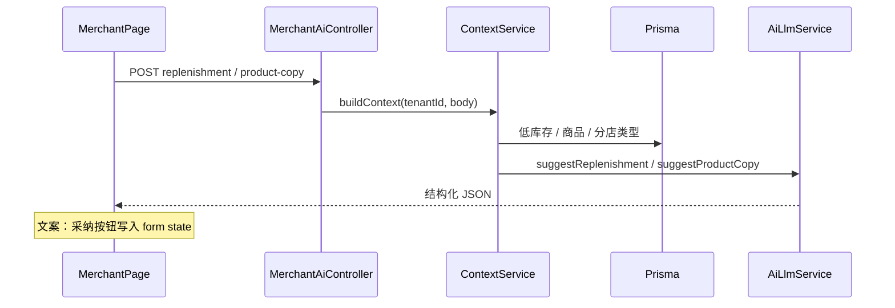

# 商户 AI 经营提效 — 库存补货 + 商品文案

**日期**: 2026-07-07  
**状态**: 已批准  
**负责人**: MeridianERP 开发团队

---

## 1. 背景与目标

### 已落地 AI 能力

- Admin：全局运营诊断 + 场景化 AI（提现 / 配送 / 资金 KPI）
- 商户 CRM 插件：线索 / 联系人只读跟进建议

### 问题

| 场景 | 页面 | 痛点 |
|------|------|------|
| 库存补货 | `/inventory/alerts` | 商户知道「缺货」，但不知道补多少、优先级、是否合并补货 |
| 商品文案 | `/catalog/products` | 分店上架 HQ 商品时需写描述，手工慢且质量不一 |

### 目标

在商户核心模块内嵌入按需 AI 能力：

1. **库存补货建议** — 只读：优先级、建议量、理由
2. **商品文案助手** — 生成标题 / 描述，支持一键填入编辑表单（用户手动保存）

**用户**：分店 / 旗舰店商户（`apps/merchant`）

---

## 2. 方案选择

采用 **双端点 + 统一 `AiLlmService`**（与 CRM / Admin 场景化 AI 一致）。

| 方案 | 结论 |
|------|------|
| 双端点 + AiLlmService | ✅ 推荐 |
| 单一 `/merchant/ai/assist` | ❌ schema / RBAC 混杂 |
| 文案纯前端 LLM | ❌ 密钥暴露、无法 mock |

---

## 3. 架构与数据流



### 模块布局

```
apps/api/src/merchant/
├── inventory/ai/
│   ├── inventory-ai.controller.ts
│   ├── replenishment-ai.service.ts
│   └── prompts/replenishment-system-prompt.ts
└── catalog/ai/
    ├── catalog-ai.controller.ts
    ├── product-copy-ai.service.ts
    └── prompts/product-copy-system-prompt.ts

apps/api/src/ai/llm/
├── replenishment-mock.client.ts
├── product-copy-mock.client.ts
├── merchant-ai.types.ts
└── ai-llm.service.ts  (+ suggestReplenishment / suggestProductCopy)

packages/shared/src/merchant-ai.ts
```

`MerchantModule` 已 import `AiModule`；AI controller / service 注册于 merchant 子模块。

**权限**：`MerchantAuthGuard` + tenant 隔离；**不需要** CRM 插件门控。

---

## 4. 共享契约 — `packages/shared/src/merchant-ai.ts`

```typescript
export type ReplenishmentUrgency = 'critical' | 'high' | 'medium';

export interface ReplenishmentPriorityItem {
  variantId: string;
  sku: string;
  urgency: ReplenishmentUrgency;
  suggestedQty: number;
  rationale: string;
}

export interface ReplenishmentSuggestion {
  summary: string;
  priorities: ReplenishmentPriorityItem[];
  recommendations: string[];
  sources: { type: string; ref: string }[];
}

export interface ProductCopyDraft {
  name?: string;
  description?: string;
  categoryId?: string;
  sku?: string;
  price?: number;
}

export interface ProductCopyRequest {
  productId?: string;
  draft?: ProductCopyDraft;
}

export interface ProductCopySuggestion {
  title: string;
  description: string;
  bulletPoints?: string[];
  tone?: string;
  sources: { type: string; ref: string }[];
}
```

---

## 5. API 规格

| 方法 | 路径 | Request | Response | 状态码 |
|------|------|---------|----------|--------|
| `POST` | `/api/v1/merchant/inventory/ai/replenishment` | `{}` | `ReplenishmentSuggestion` | 201 |
| `POST` | `/api/v1/merchant/catalog/ai/product-copy` | `ProductCopyRequest` | `ProductCopySuggestion` | 201 |

### 5.1 ReplenishmentAiService 上下文

```typescript
{
  tenantId: string;
  isFlagship: boolean;
  businessName?: string;
  defaultReorderThreshold: number;
  alerts: LowStockAlertItem[];          // 复用 MerchantStockService.lowStockAlerts()
  recentOutbound?: Array<{
    variantId: string;
    sku: string;
    totalQty: number;
  }>;
  pendingProcurement?: Array<{
    masterSkuId: string;
    sku: string;
    qtyPending: number;
  }>;
}
```

**规则：**

- `alerts` 为空 → 仍返回 201，`summary` 说明无低库存，`priorities` 为空数组
- 最多注入 **20 条** alert（按 `quantityOnHand` 升序）
- 分店（`!isFlagship`）查在途 `BranchPurchaseOrder` 行；旗舰店查 open `PurchaseOrder` 行（若存在）

### 5.2 ProductCopyAiService 上下文

**productId 模式：**

```typescript
{
  product: { id, name, description, categoryName, isPublished };
  variant: { sku, price, masterSkuRetailPrice? };
  isBranchLinked: boolean;
}
```

**draft 模式（新建商品）：**

```typescript
{
  draft: { name?, description?, categoryName?, sku?, price? };
  isBranchLinked: false;
}
```

**校验：**

- `productId` 与 `draft` 至少其一；两者都有时以 `productId` 为准
- 越权 tenant → `404 Product not found`
- 纯 draft 且 `name` 与 `sku` 均为空 → `400`

---

## 6. LLM 层

### 6.1 AiLlmService 扩展

```typescript
async suggestReplenishment(context: ReplenishmentContext): Promise<ReplenishmentSuggestion>
async suggestProductCopy(context: ProductCopyContext): Promise<ProductCopySuggestion>
```

Live 模式：`AnthropicLlmClient.completeMessages` + JSON 解析；失败 fallback mock。

### 6.2 Mock 启发式 — 库存

| 条件 | urgency | suggestedQty |
|------|---------|--------------|
| `quantityOnHand === 0` | `critical` | `threshold * 2` |
| `quantityOnHand <= threshold / 2` | `high` | `threshold * 2 - onHand` |
| 其余 | `medium` | `threshold - onHand + threshold` |

recommendations 区分分店（总部进货）与旗舰店（采购单 / 调整）。

### 6.3 System Prompts

**库存补货** — 输出 JSON（无 markdown 围栏）：

```json
{
  "summary": "一句话总览",
  "priorities": [
    {
      "variantId": "uuid",
      "sku": "SKU-001",
      "urgency": "critical|high|medium",
      "suggestedQty": 10,
      "rationale": "理由"
    }
  ],
  "recommendations": ["建议1"],
  "sources": [{ "type": "low_stock_alerts", "ref": "12 items" }]
}
```

约束：`variantId` / `sku` 必须来自输入；`suggestedQty` 为正整数；分店不提「自建 SKU」。

**商品文案** — 输出 JSON：

```json
{
  "title": "优化后标题（≤40字）",
  "description": "2-4 段描述",
  "bulletPoints": ["卖点1"],
  "tone": "专业亲和",
  "sources": [{ "type": "product", "ref": "name+category" }]
}
```

约束：不编造未提供规格；禁止 HTML；`isBranchLinked` 时注明可本地化描述。

---

## 7. 前端

### 7.1 库存补货 — `/inventory/alerts`

- 新组件：`InventoryAiReplenishmentPanel`（参照 `CrmAiFollowUpPanel`）
- 落点：`ListPageFrame` 内、`LowStockAlertsTable` 上方
- 交互：「生成建议」→ 只读展示 summary / priorities / recommendations
- urgency Badge：`critical`=destructive，`high`=warning，`medium`=secondary
- priority 行可链至 `/inventory/procurement`（分店）或采购相关页（旗舰店）

### 7.2 商品文案 — 编辑 Sheet

- 新组件：`ProductCopyAiPanel`
- 落点：`products-table.tsx` Sheet 内，variant 区块下方
- Props：`token`, `productId?`, `draft`（来自 form state）
- 「采纳标题」→ `setForm({ ...form, name })`；不自动改 slug
- 「采纳描述」→ `setForm({ ...form, description })`
- Badge：「采纳后需手动保存」

### 7.3 i18n

`packages/shared/src/i18n/messages/{zh-CN,en}/merchant.ts`：

- `merchant.inventory.ai.*`
- `merchant.catalog.ai.*`

---

## 8. 文档（phase gate）

| 文档 | 路径 |
|------|------|
| PRD | `docs/prd/merchant-ai-efficiency.md` |
| Architecture | `docs/architecture/merchant-ai-efficiency.md` |
| Design | `docs/design/merchant-ai-efficiency.md` |
| PRODUCT.md | 更新商户 AI 摘要 |

---

## 9. 测试

| 文件 | 覆盖 |
|------|------|
| `merchant-inventory-ai-replenishment.e2e-spec.ts` | seed 低库存 → 201 + priorities；空 alerts |
| `merchant-catalog-ai-product-copy.e2e-spec.ts` | productId；draft；越权 404 |
| 回归 | CRM AI、Admin AI、diagnosis e2e |

`apps/api/test/setup.ts` 保持 `AI_MODE=mock`。

---

## 10. 验收标准（P0）

1. `/inventory/alerts` 可生成只读补货建议，含优先级与建议量
2. 商品编辑 Sheet 可生成文案，「采纳标题 / 描述」填入表单，保存走现有 API
3. `AI_MODE=mock` 无外部依赖；live 失败 fallback mock
4. Tenant 隔离正确；`rtk pnpm typecheck` 与相关 e2e 通过

---

## 11. 明确不做（本波）

- 自动创建进货单 / 自动保存商品
- 列表页批量文案
- 新 merchant 插件 code
- 销量预测模型（无历史销量 API；用阈值 + 缺口启发式）
- 自动修改 slug
